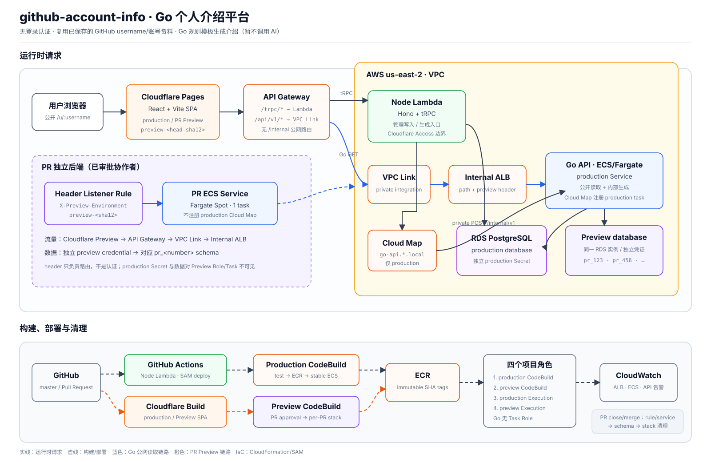

# GitHub 账号信息

基于 Turborepo + pnpm workspaces 的 monorepo 项目，用于管理多个 GitHub 账号的个人信息。通过 GitHub Personal Access Token（PAT）拉取账号数据，支持在线编辑并持久化保存到数据库。



## 功能特性

- **Token 管理**：添加多个 GitHub PAT，以账号卡片形式展示（头像 + 用户名 + 统计数据），点击卡片切换账号
- **账号信息编辑**：查看并编辑 GitHub 账号详情（姓名、简介、公司、地址、邮箱、博客、Twitter），保存到数据库
- **智能数据加载**：优先从数据库加载已保存的数据，无记录时自动从 GitHub 拉取，并标注数据来源
- **手动刷新**：支持一键从 GitHub 拉取最新数据覆盖本地，再手动保存入库
- **个人介绍生成**：Go 根据已经保存的 GitHub username 与账号资料生成稳定的中文介绍，第一版不调用 AI
- **公开个人主页**：通过 `/u/$username` 无登录读取已发布的个人介绍，不需要 GitHub PAT
- **生产默认只读**：production Lambda 关闭管理型 tRPC；账号维护、PAT 拉取和介绍生成默认只在本地显式开启
- **端到端类型安全**：tRPC + Drizzle + zod 全链路类型推导，无需手写接口类型

## 技术栈

| 层级 | 技术 |
| --- | --- |
| 前端 | React + TanStack Router + Tailwind CSS v4 |
| 后端 | Node Lambda（Hono + tRPC）与 Go REST API |
| 数据库 | Drizzle ORM + PostgreSQL（当前生产环境为 Amazon RDS） |
| 工具链 | Turborepo + pnpm workspaces + Biome + TypeScript |
| UI 组件 | shadcn/ui（共享包 `packages/ui`） |

## 项目结构

```
github-account-info/
├── apps/
│   ├── web/         # React + TanStack Router 前端
│   ├── server/      # Node Hono + tRPC 服务端入口
│   └── go-api/      # 个人介绍生成与公开读取 REST API
├── packages/
│   ├── api/         # tRPC procedure 定义（端到端类型源）
│   ├── db/          # Drizzle schema 与 migration
│   ├── preview-environment/ # Cloudflare 与 CodeBuild 共享的 PR preview key
│   ├── ui/          # 共享 shadcn/ui 组件
│   ├── env/         # 环境变量校验
│   └── config/      # 共享 TypeScript / Biome 配置
├── infra/           # ECR/ECS/ALB/Cloud Map/CodeBuild 与 PR 环境 IaC
├── specs/           # 开发规格文档
└── docs/            # 需求文档
```

## 快速开始

### 1. 安装依赖

```bash
pnpm install
```

### 2. 配置环境变量

复制并填写服务端环境变量：

```bash
cp apps/server/.env.example apps/server/.env
```

需要配置的变量：

```env
DATABASE_URL=你的 PostgreSQL 连接串
CORS_ORIGIN=http://localhost:3001
GO_API_INTERNAL_URL=http://localhost:8080
MANAGEMENT_API_ENABLED=true
```

前端环境变量：

```env
VITE_SERVER_URL=http://localhost:3000
VITE_GO_API_URL=http://localhost:8080
```

### 3. 初始化数据库

```bash
# 应用 migration（推荐）
pnpm db:migrate

# 或本地快速推送 schema（不生成 migration 文件）
pnpm db:push
```

### 4. 启动开发服务

```bash
# 同时启动前端和后端
pnpm dev

# 或分别启动
pnpm dev:web     # 前端 http://localhost:3001
pnpm dev:server  # 后端 http://localhost:3000
pnpm dev:go      # Go API http://localhost:8080
```

## 使用说明

1. 打开 `http://localhost:5173`，进入 **Token 管理** 页
2. 填写名称和 GitHub PAT（需要 `read:user` 权限），点击「添加 Token」
3. 验证成功后出现账号卡片，点击卡片进入 **账号信息** 页
4. 查看/编辑账号信息，点击「保存到数据库」持久化
5. 点击「生成个人介绍」，由 Node 调用 Go 内部接口生成并保存结果
6. 通过 `/u/<GitHub username>` 查看无需登录的公开个人主页

## 常用命令

| 命令 | 说明 |
| --- | --- |
| `pnpm dev` | 启动所有服务（开发模式） |
| `pnpm dev:go` | 启动 Go REST API |
| `pnpm build` | 构建所有应用 |
| `pnpm check` | Biome 格式化 + lint 并自动修复 |
| `pnpm check-types` | 全仓库 TypeScript 类型检查 |
| `pnpm check:infra` | 校验 API Gateway、production 与 PR 基础设施安全边界 |
| `pnpm db:generate` | 根据 schema 生成 migration 文件 |
| `pnpm db:migrate` | 应用 migration 到数据库 |
| `pnpm db:push` | 直接推送 schema（仅本地快速迭代） |
| `pnpm db:studio` | 打开 Drizzle Studio 可视化调试 |
