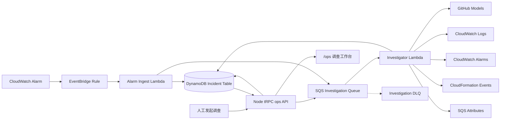

AI Ops Agent 是当前项目的第四组运维能力。它建立在 CloudWatch 监控、Synthetics、
SNS/SQS/DLQ 和灰度发布之上，把“收到告警后人工翻日志、看部署、查队列”的过程，
整理成一次有状态、有证据、可回看的只读调查。

<Callout title="当前完成状态">
  AWS Stack、GitHub Models Secret、Node API 接入和受控手工调查真实链路均已完成
  验收。一次调查已经完整经过 Node API、DynamoDB、SQS、Investigator Lambda、
  GitHub Models 和 DynamoDB 回写，并由 `ops.get` 读到 `completed`。自动告警状态
  变化、profile events DLQ 演练和首周费用观察仍是保留验收项。
</Callout>

## 先看结论

这一功能不是让 AI 直接操作生产环境，而是让 AI 帮人整理只读证据：

1. CloudWatch 告警或人工请求创建一条调查记录。
2. SQS 把调查异步交给 Investigator Lambda，避免页面长时间等待模型。
3. Agent 只能调用白名单内的只读工具，查询健康状态、近期错误、部署事件和队列。
4. 每条证据先脱敏、截断，再交给 GitHub Models 分析。
5. 模型输出必须通过结构化校验，结论必须引用真实 evidence ID。
6. 调查结果写回 DynamoDB，由 Node tRPC 和 `/ops` 页面展示。
7. 修复建议永远需要人工审批；第一版 Agent 没有生产修复权限。

用一句白话概括：**它是一个会收集证据并写调查报告的值班助手，不是一个会擅自改
生产环境的自动驾驶系统。**

## 架构



| 层级 | 负责什么 | 明确不负责什么 |
| --- | --- | --- |
| EventBridge + Alarm Ingest | 接收告警状态变化、去重并创建调查 | 不调用模型，不执行修复 |
| Node `ops` API | 创建人工调查、查询调查列表和详情 | 不直接读取任意 AWS 资源 |
| DynamoDB | 保存状态、问题、证据、结论、失败信息和 TTL | 不承担消息重试 |
| SQS + DLQ | 异步排队、控制消费速度、暂时失败重试 | 不代表调查已经完成 |
| Investigator Lambda | 编排只读工具、模型和结果校验 | 不拥有 ECS、Lambda、Stack 修复权限 |
| GitHub Models | 根据受控证据生成结构化结论 | 不直接连接 AWS，不接收 Secret |
| `/ops` 页面 | 展示进度、证据、结论和建议 | 不提供一键执行生产修复 |

### 两种调查入口

告警调查和人工调查最终进入同一条队列、使用同一套状态机：

```text
CloudWatch 告警 → EventBridge → Alarm Ingest ┐
                                               ├→ DynamoDB + SQS → Investigator
用户提交问题 → Node ops.create ───────────────┘
```

区别只在来源：

- 告警入口自动带入固定的组件、告警名称和状态变化。
- 人工入口由用户选择受支持的组件并填写调查问题。

之后的取证、模型分析、校验、持久化和页面展示完全复用，避免维护两套调查逻辑。

## 完整实现过程

下面按真实开发顺序说明。每一步先回答“为什么需要它”，再说明代码如何落地。

### 第 1 步：先限定 Agent 的能力边界

第一版没有从“做一个通用 AI 运维平台”开始，而是只支持本项目已经存在的几个资源：

- Node API；
- Go API；
- profile event consumer；
- profile event 主队列；
- profile event DLQ。

原因很直接：如果一开始允许模型传入任意 ARN、URL、shell 或 Logs Insights query，
就很难证明它不会越权读取、泄漏数据或执行危险操作。

因此代码先建立 resource catalog。模型只会看到 `node-api`、`go-api` 这类稳定枚举，
真正的 Log Group、Stack、Alarm 和 Queue 由服务端映射。模型无法自己拼接 AWS 资源。

### 第 2 步：定义共享调查契约和状态机

创建 `packages/ai-ops-schema`，统一 Web、Node API、两个 Lambda 和 DynamoDB 的数据
边界。核心对象包括：

- `incident`：一次调查的完整记录；
- `evidence`：从只读工具获得的证据；
- `investigation`：模型最终输出；
- `failure`：失败类型和可公开错误信息；
- `recommendation`：需要人工审批的处置建议。

调查状态固定为：

```text
queued → investigating → completed
                       └→ failed
```

状态不是页面自己猜出来的。Repository 使用条件更新，只有处于预期旧状态的记录才
能进入下一状态，避免 SQS 重试或并发消费把已经完成的调查改回处理中。

`failure` 在所有状态都存在：没有失败时保存 `null`，而不是删除字段。这样共享 schema
可以保持稳定，旧记录也不会因为缺少字段拖垮整个列表查询。

### 第 3 步：建立独立的 AI Ops app

Agent 位于 `apps/ai-ops-agent`，没有塞进现有 Node API。这样拆分有三个好处：

1. Node API 继续负责短请求，不需要携带 Mastra、模型 provider 和 AWS 调查依赖。
2. Investigator 可以单独设置超时、内存、SQS 并发和 IAM 权限。
3. Agent 出错或模型限流时，不会阻塞 GitHub 账号、个人主页等正常业务。

应用内部再按职责拆开：

```text
handlers/      Lambda 入口与 SQS 失败分类
agent/         Mastra 编排、prompt 和结构化输出
tools/         四类只读 AWS 工具
aws/           固定资源映射和 AWS Client
repository/    DynamoDB 条件更新与兼容读取
security/      脱敏、截断和安全边界
```

它是独立部署单元，但 incident schema 仍由 workspace package 共享，避免前后端各写
一份相似却不完全一致的类型。

### 第 4 步：实现四类只读工具

Investigator 第一版只提供四种调查能力：

| 工具 | 回答的问题 | 主要 AWS 数据源 |
| --- | --- | --- |
| Service Health | 服务现在是否健康 | CloudWatch Alarm |
| Recent Errors | 最近是否出现错误日志 | CloudWatch Logs |
| Recent Deployments | 最近是否刚发生部署 | CloudFormation Events |
| Queue Health | 是否有积压或死信 | SQS Attributes |

工具输入只允许 component/queue enum。以“检查 Node API 最近错误”为例，模型只提交
类似 `{ component: "node-api" }` 的参数，代码再从 resource catalog 找到允许查询的
Log Group。

工具输出也不直接原样进入模型：

1. 删除 token、Authorization、连接串等敏感模式；
2. 截断单条文本和结果数量；
3. 转成统一 evidence；
4. 分配稳定 evidence ID；
5. 再交给模型引用。

因此模型接触的是“经过边界控制的证据摘要”，不是 AWS 账号的自由查询权限。

### 第 5 步：接入 Mastra 与 GitHub Models

Mastra 负责 Agent 的工具调用和多步推理，默认模型是 GitHub Models 的
`openai/gpt-4.1`。

凭证采用独立 GitHub token：

- 只授予 `models:read`；
- token value 只保存在 AWS Secrets Manager；
- Lambda 环境变量只保存 Secret ARN；
- CloudFormation、GitHub Variables、日志和 API 响应都不能出现 token value；
- ChatGPT 会员登录态不能替代 GitHub Models API token。

单次调查最多 4 个模型 step、6 次工具调用。这个上限既控制费用和时延，也防止模型
在证据不足时无限重复查询。

### 第 6 步：收紧模型输出

模型的自然语言“看起来合理”不等于可以直接写数据库。最终输出必须满足固定 schema：

- `summary`：调查结论；
- `rootCause`：证据足够时才填写，否则为 `null`；
- `severity` 和 `risk`：只能使用内部枚举；
- `hypotheses`：每个判断必须引用真实 evidence ID；
- `recommendations`：每条建议都标记 `approvalRequired: true`。

Mastra 的 `structuredOutput` 可能在 `agent.generate()` 内直接抛出校验错误，而不是
返回一个空 object。因此代码把
`STRUCTURED_OUTPUT_SCHEMA_VALIDATION_FAILED` 映射为领域错误
`InvalidModelOutputError`，并将本次调查终止为 `INVALID_MODEL_OUTPUT`。

provider 偶尔会返回语义合理、但不属于内部枚举的 `severity: "none"` 或
`risk: "none"`。边界层把它们归一化为最低等级 `low`，之后仍执行完整 schema
校验；共享契约和页面状态不为 provider 的表达习惯让步。

### 第 7 步：实现告警接收和去重

EventBridge 监听指定 CloudWatch Alarm 的状态变化，并调用 Alarm Ingest Lambda。
Ingest 做的事情保持很轻：

1. 校验事件来源、告警和状态；
2. 根据告警、状态和时间窗口生成去重键；
3. 在 DynamoDB 创建 `queued` incident；
4. 把 incident ID 写入 SQS；
5. 重复事件命中条件写保护时安全结束。

相同告警在 5 分钟窗口内重复抖动不会创建大量相同调查。真正的模型调用留给
Investigator，避免 EventBridge 调用长期占用。

### 第 8 步：实现 SQS Investigator

Investigator 的消费过程是：

```text
读取 incident ID
  → 条件更新为 investigating
  → 收集只读证据
  → 调用模型
  → 校验 evidence 引用和结构化结果
  → 写回 completed
```

SQS 使用 `BatchSize: 1` 和 `MaximumConcurrency: 2`。这样低配额 AWS 账号不需要
占用 Lambda reserved concurrency，也不会同时发起过多模型请求。

失败被分为两类：

- 非重试错误：消息格式错误、记录不存在、模型输出不合法等，写入明确 failure 后
  结束，避免毒消息反复消耗模型额度。
- 暂时错误：GitHub Models 限流、网络或 AWS 暂时异常，通过 partial batch failure
  交还 SQS 重试，超过次数后进入 DLQ。

### 第 9 步：设计 DynamoDB 存储

DynamoDB 适合这里的原因不是“AI 必须用 NoSQL”，而是调查记录天然按 incident ID
读写，状态更新频繁、数据量低，并且 Lambda 可直接按需访问。

表中保留：

- 调查来源、组件、问题和创建时间；
- 当前状态和更新时间；
- evidence 列表；
- 结构化 conclusion；
- nullable failure；
- 30 天 TTL；
- 用于列表查询的 GSI；
- Point-in-Time Recovery。

读取边界还兼容早期已经写入、但缺少 `failure` 字段的旧文档：只对这一种已知旧形态
补成 `null`，其他非法非空值仍然拒绝。兼容历史数据不能靠放宽共享 schema 完成。

### 第 10 步：接入 Node tRPC API

Node API 增加三类 procedure：

| Procedure | 用途 |
| --- | --- |
| `ops.create` | 创建人工调查并入队 |
| `ops.list` | 按时间返回调查摘要 |
| `ops.get` | 返回单次调查的完整进度、证据和结论 |

Node Stack 不在 GitHub Secrets 或 Variables 里重复维护表名和队列 ARN。部署时直接
读取 AI Ops Stack Outputs，再作为参数注入 Node Stack。

兼容规则是“全空或全有”：

- Agent Stack 尚未部署时，四项配置全部为空，Node 原功能正常部署；
- Agent Stack 已存在时，表 Name/ARN 和队列 URL/ARN 必须四项齐全；
- 只拿到半套配置时立即失败，不能部署一个运行到一半才报错的 `/ops`。

### 第 11 步：实现 `/ops` 调查工作台

页面分为左侧调查记录和右侧调查详情：

- 左侧显示状态、时间和问题摘要；
- 右侧显示用户问题、Agent 进度、结论、可能根因、关键证据和建议；
- 只有 `queued`、`investigating` 状态按 4 秒轮询；
- `completed`、`failed` 停止自动请求；
- 页面不渲染任何 Secret 或底层任意 ARN。

双栏布局使用 `items-start` 和侧栏 `self-start`，避免右侧长详情强制把短侧栏拉成
同高。侧栏列表按内容增长，到达视口上限后才独立滚动；sticky 的 `top` 按当前导航
是否吸顶计算，避免页面滚动后侧栏悬在中间。

### 第 12 步：把基础设施和权限写进 IaC

`infra/ai-ops.yaml` 创建：

- DynamoDB Incident Table；
- Investigation Queue 和 DLQ；
- Alarm Ingest Lambda；
- Investigator Lambda；
- 两个固定 CloudWatch Log Group；
- DLQ 消息告警；
- 主队列最长消息年龄告警；
- EventBridge 告警状态变化规则；
- Node Stack 需要的表和队列 Outputs。

部署角色权限也由独立 policy Stack 管理。Agent 运行时 IAM 和部署 IAM 分开：
部署角色可以创建受控资源，Investigator 运行时角色只允许读取固定证据源和更新本次
调查所需的数据。

## 调查数据如何理解

页面里最重要的不是 AI 写了多少字，而是结论能否追溯到证据。

| 页面内容 | 白话解释 |
| --- | --- |
| 调查问题 | 这次到底要检查什么 |
| 调查进度 | 请求目前排队、取证、完成还是失败 |
| 调查结论 | Agent 根据当前证据得到的摘要 |
| 可能根因 | 证据足够时给出；不足时明确为空 |
| 关键证据 | 来自哪个工具、观察到什么、何时采集 |
| 置信度 | 当前证据对结论的支持程度，不代表绝对正确 |
| 处置建议 | 给人参考的下一步，默认需要人工审批 |

`completed` 只表示 Agent 按契约完成了调查，不表示系统一定存在故障，也不表示建议
已经执行。健康检查完全可以以“未发现异常”完成。

## 只读安全边界

这套设计通过多层边界防止“模型说了算”：

1. **输入白名单**：工具只接收稳定 enum，不接受任意 ARN、URL、shell 或 query。
2. **固定资源映射**：真实 AWS 标识只存在服务端 resource catalog。
3. **最小 IAM**：Investigator 只能读指定日志、告警、部署和队列状态。
4. **证据脱敏**：日志先脱敏和截断，再进入模型。
5. **结构化输出**：模型结果必须通过 Zod schema。
6. **引用校验**：hypothesis 不能引用不存在的 evidence ID。
7. **根因可空**：证据不足时必须承认不知道。
8. **无自动修复**：建议永远标记需要人工审批。

因此即使 prompt 被误导，模型也拿不到一条可以执行生产写操作的工具路径。

## AWS 部署

### AWS 中创建了哪些资源

| AWS 服务 | 本功能中的作用 | 费用特点 |
| --- | --- | --- |
| EventBridge | 接收指定 Alarm 状态变化 | 低频事件按量 |
| Lambda | 告警接收和调查执行 | 按调用与运行时长 |
| SQS + DLQ | 调查排队、重试和死信 | 按请求量 |
| DynamoDB | 保存调查状态和结果 | 按需读写与存储 |
| Secrets Manager | 保存 GitHub Models token | 主要固定增量费用 |
| CloudWatch Logs | 保存两个 Lambda 的运行日志 | 按写入和保留量 |
| CloudWatch Alarm | 监控 DLQ 和队列年龄 | 按告警数量 |

### GitHub Actions 工作流

入口是 `.github/workflows/ai-ops-change-set.yml`。它只允许手工触发，避免普通 push
直接改变生产 AWS 资源。

| 操作 | 用途 | 是否立即改变资源 |
| --- | --- | --- |
| `create-policy-change-set` | 生成部署角色最小权限变更 | 否，只创建待审 Change Set |
| `execute-policy-change-set` | 执行已经人工审查的权限变更 | 是 |
| `create-model-secret` | 创建或更新 GitHub Models Secret | 是 |
| `create-agent-change-set` | 打包并生成 Agent 资源变更 | 否，只创建待审 Change Set |
| `execute-agent-change-set` | 执行已经人工审查的 Agent 变更 | 是 |
| `delete-failed-agent-stack` | 精确清理失败创建遗留 | 是，仅允许失败状态 |

所有 AWS 操作使用 GitHub Actions OIDC 短期凭证，不保存长期 AWS access key，也不用
本机 root 身份做日常部署。

### 推荐部署顺序

1. 合并经过审查的代码到部署角色信任的 `master`。
2. 在 GitHub repository secret 配置 `AI_OPS_GITHUB_MODELS_TOKEN`。
3. 创建 deployer policy Change Set。
4. 在 AWS 控制台审查权限资源范围后执行。
5. 通过 workflow 创建或更新 Secrets Manager Secret。
6. 创建 AI Ops Agent Change Set。
7. 审查 DynamoDB、SQS、Lambda、EventBridge、Log Group 和 Alarm。
8. 执行 Change Set，并等待 Stack 真正完成。
9. 更新 Node Stack，使它读取 Agent Stack 的四项 Output。
10. 从 `/ops` 发起一次受控人工调查并完成回读。
11. 再分别验收真实告警、DLQ 和费用边界。

创建 Change Set 成功只说明“方案已生成”，不代表资源已经部署。执行 Change Set
返回成功也不代表 Stack 已完成；workflow 必须继续等待 CloudFormation waiter。

### Node 如何接入 Agent Stack

Node 部署流程读取以下四类 Output：

- Incident Table Name；
- Incident Table ARN；
- Investigation Queue URL；
- Investigation Queue ARN。

这样资源物理名称只由 CloudFormation 管理，不在多个 GitHub Secret/Variable 里
重复保存。AI Ops 尚未部署的环境仍可部署 Node，只是 `/ops` 不启用。

### 失败 Stack 如何清理

AI Ops Table 和 Log Group 带保留策略。创建失败回滚后，它们可能脱离 Stack 继续
存在，下一次创建会因为同名资源再次失败。

清理 workflow 因此有严格保护：

- 只允许 `ROLLBACK_COMPLETE` 或 `CREATE_FAILED`；
- 先等待 Stack 删除完成；
- 再按完整固定名称逐个清理本功能遗留表和 Log Group；
- 不接受通配符和任意前缀；
- 不删除模型 Secret、部署策略 Stack 或其他业务资源。

它是失败创建的恢复工具，不是通用资源删除入口。

## 真实部署过程与踩坑

下面保留真实部署中遇到的问题。统一用“现象—原因—修复—教训”表达，方便以后遇到
相似错误时快速定位。

### 1. 创建 Change Set 前就缺权限

**现象：** workflow 还没创建 Agent Stack，就在读取现有 profile queue 时失败。

**原因：** 部署流程需要用 `sqs:GetQueueAttributes` 把已有 Queue URL 解析为 ARN，
但 deployer policy 只覆盖了准备新建的 AI Ops Queue。

**修复：** 只为两个既有 profile queue 补充精确的 `sqs:GetQueueAttributes`。

**教训：** 资源发现也是权限需求，但应补最小只读权限，不能直接扩大成 `sqs:*`。

### 2. Log Group 权限看似存在仍失败

**现象：** CloudFormation 创建固定 Log Group 时返回 AccessDenied。

**原因：** CloudWatch Logs 的部分操作要求同时匹配 Log Group 精确 ARN 和
`:*` 子资源 ARN。

**修复：** deployer policy 同时列出两种精确形式。

**教训：** 控制面权限不能只看 action 名称，还要核对 AWS 实际评估的资源 ARN。

### 3. GitHub Actions 显示成功，Stack 却在回滚

**现象：** `execute-change-set` 命令返回后 workflow 变绿，但 CloudFormation 仍在
创建或已经进入失败回滚。

**原因：** 工作流没有等待 Stack 终态。

**修复：** 执行前读取 Stack 状态。新建 Stack 的空壳状态是
`REVIEW_IN_PROGRESS`，使用 create waiter；已有 Stack 使用 update waiter。

**教训：** API 调用成功不等于异步云资源成功，验收必须等待终态并读取最早失败事件。

### 4. 低配额账号无法设置 reserved concurrency

**现象：** `ReservedConcurrentExecutions: 1` 仍导致 Lambda 创建失败。

**原因：** AWS 账号要求至少保留 10 个 unreserved concurrency，当前账号总额度较低。

**修复：** 去掉 reserved concurrency，改用 SQS event source 的
`MaximumConcurrency: 2` 和 `BatchSize: 1` 控制模型并发。

**教训：** 并发边界应结合账号实际配额设计，不能照搬高配额生产账号参数。

### 5. Retain 资源阻塞再次创建

**现象：** 删除失败 Stack 后，再次部署提示 DynamoDB Table 或 Log Group 已存在。

**原因：** `DeletionPolicy: Retain` 使资源在回滚和删栈后仍被保留。

**修复：** 增加仅面向失败状态、只删除完整固定名称的清理操作。

**教训：** Retain 保护正常数据，也会改变失败恢复流程；模板设计时必须同时写清恢复
办法。

### 6. EventBridge 自动名称被截断

**现象：** CloudFormation 创建 EventBridge Rule 时权限不匹配。

**原因：** SAM 自动生成的物理名受长度限制被截断，不再包含 IAM policy 预期的完整
`ai-ops` 前缀。

**修复：** 在模板中显式设置稳定 `RuleName`，policy 精确匹配该 ARN。

**教训：** 最小权限依赖资源名称时，不能假定框架自动生成的物理名永远稳定。

### 7. Change Set 类型被误判

**现象：** CREATE 成功后 workflow 却等待 update waiter，最终长时间超时。

**原因：** `describe-change-set` 响应没有可依赖的 `ChangeSetType` 字段，查询结果为
`None`。

**修复：** 不再猜 Change Set 类型，而是读取 Stack 状态：
`REVIEW_IN_PROGRESS` 代表首次创建，其他已存在状态走更新。

**教训：** workflow 判断必须基于 AWS 确实返回且语义稳定的字段。

### 8. ESM bundle 构建成功但 Lambda 冷启动失败

**现象：** TypeScript、单测和 esbuild 都成功，Lambda import 最终 `.mjs` 时却报
`Identifier 'createRequire' has already been declared`。

**原因：** esbuild banner 注入的 `createRequire` 与依赖保留的同名顶层 import 冲突。

**修复：** banner helper 改为项目私有别名 `__createRequire`，并在 workflow 中用目标
Node 版本直接 import 最终 bundle。

**教训：** 构建成功不能覆盖 Lambda ESM 冷启动验证，最终产物必须实际加载一次。

### 9. 模型输出错误没有进入预期失败分支

**现象：** provider 返回非法结构时，错误在 `agent.generate()` 内抛出，SQS 不断重试。

**原因：** 代码只检查 `result.object`，没有捕获 Mastra 的结构化输出校验异常。

**修复：** 显式识别错误 ID，映射为不可重试的 `INVALID_MODEL_OUTPUT`。

**教训：** 第三方编排框架的错误可能在返回前抛出，必须测试失败路径而不只测试正常
对象。

### 10. 旧 DynamoDB 记录拖垮整个列表

**现象：** 一条早期 incident 缺少 `failure` 字段，导致 `ops.list` 严格解析返回 500。

**原因：** schema 收紧后，没有在持久化读取边界兼容已知旧形态。

**修复：** 仅把缺失 `failure` 的旧文档归一化为 `failure: null`，继续拒绝其他非法值。

**教训：** schema 演进既要保持新写入严格，也要在明确边界兼容历史数据。

## 云端验收

### 已完成的真实链路

受控人工调查已经完成以下闭环：

```text
/ops 或 ops.create
  → Node Lambda
  → DynamoDB 写入 queued
  → SQS Investigation Queue
  → Investigator Lambda
  → 只读 AWS evidence
  → GitHub Models
  → DynamoDB completed
  → ops.get 和页面回读
```

验收不只看 HTTP 200，还核对：

- incident 状态按顺序变化；
- SQS 消息被正确消费；
- Investigator 日志没有泄漏 token；
- evidence ID 与 hypothesis 引用一致；
- completed 文档满足共享 schema；
- `ops.get` 能读回结论；
- 调查完成后页面停止轮询。

### 仍保留的验收项

| 保留项 | 还要证明什么 |
| --- | --- |
| 自动告警状态变化 | CloudWatch Alarm 能经 EventBridge 自动创建调查 |
| profile events DLQ 演练 | 真实队列异常能触发调查并给出正确只读证据 |
| 首周费用观察 | 实际 Secrets Manager、日志、Lambda 和模型使用符合预期 |

代码完成、静态模板验证、Stack 部署和真实业务验收是四个不同里程碑。本文会明确写
出保留项，不把“测试通过”描述成“所有自动场景都已上线验收”。

## 成本与容量边界

低频使用环境下，AWS 增量估算约为每月 **0.40–0.50 美元**，主要固定项是一个
Secrets Manager Secret。Lambda、SQS、EventBridge、DynamoDB 和 CloudWatch Logs
按实际调用和存储量计费；这只是低频估算，不是费用上限。

GitHub Models 免费额度是独立容量边界。当前设计按 High 档约 10 RPM、50 RPD 规划，
每次调查最多 4 个模型 step，保守按每天约 12 次完整调查估算。外部免费额度可能
变化，上线前仍要复核官方规则。

当额度耗尽时应明确失败或限流，不能静默切换到可能收费的 provider。否则“免费
调查助手”会在用户不知情时变成付费调用链路。

## 本地验证方法

### 1. 安装和基础检查

仓库使用 `pnpm@10.24.0`，通过 Corepack 执行：

```bash
corepack pnpm install
corepack pnpm --filter @repo/ai-ops-schema test
corepack pnpm --filter ai-ops-agent test
corepack pnpm --filter ai-ops-agent build
```

### 2. 验证最终 Lambda bundle

构建后要用目标 Node 版本实际 import `.mjs`，覆盖 ESM 冷启动类问题。只跑 TypeScript
和 esbuild 不够。

### 3. 验证模板

```bash
sam validate --lint --template-file infra/ai-ops.yaml
```

还要运行仓库中的 route、IAM 和模板边界测试，确认 Agent 没有获得生产写权限。

### 4. 验证页面

本地 Web 可以通过已有 Node API 代理访问已部署的 AI Ops 后端，不需要把 AWS
root 凭证放进浏览器或前端 `.env`。页面验证重点是：

- 空状态、排队、调查中、完成和失败五种状态；
- 只有活动调查自动轮询；
- 长详情下左侧记录不被拉伸或裁切；
- 窄屏下双栏能正常堆叠；
- 页面没有展示 Secret、token 或任意底层资源输入框。

## 常见问题速查

| 现象 | 优先检查 | 常见原因 |
| --- | --- | --- |
| 人工调查一直 queued | SQS 可见消息、event source mapping | Investigator 未触发或并发受限 |
| 调查反复重试 | failure 分类、DLQ、provider 错误 | 暂时错误未恢复，或非法输出被错判为可重试 |
| `ops.list` 返回 500 | DynamoDB 旧文档 shape | 历史记录缺少后来新增字段 |
| GitHub Actions 成功但页面不可用 | Stack Status 和 CloudFormation Events | workflow 没等待真实终态 |
| Lambda 冷启动语法错误 | 最终 `.mjs` import | esbuild banner 顶层名称冲突 |
| 模型说有根因却无证据 | hypothesis evidence IDs | 输出校验或 prompt 边界失效 |
| 页面侧栏下方大片空白 | Grid 拉伸和固定列表高度 | 短侧栏被长详情强制等高 |
| 费用异常增长 | 模型 step、日志量、调查触发频率 | 告警抖动、无限工具调用或日志未截断 |

## 代码导读

建议按一次调查的流动顺序阅读：

1. `packages/ai-ops-schema`：先看 incident、evidence 和 investigation 契约。
2. `apps/ai-ops-agent/src/handlers/alarm-ingest.ts`：告警如何去重、创建和入队。
3. `apps/ai-ops-agent/src/handlers/investigate.ts`：SQS 消费和失败分类。
4. `apps/ai-ops-agent/src/agent/`：Mastra、prompt、模型边界和结果校验。
5. `apps/ai-ops-agent/src/tools/`：四类只读证据工具。
6. `apps/ai-ops-agent/src/repository/`：DynamoDB 状态机、TTL 和兼容读取。
7. `packages/api/src/routers/ops.ts`：Node 如何创建和查询调查。
8. `apps/web/src/routes/ops.tsx`：工作台如何展示和轮询。
9. `infra/ai-ops.yaml`：AWS 资源、运行时 IAM 和 Stack Outputs。
10. `.github/workflows/ai-ops-change-set.yml`：创建、审查、执行和失败清理流程。

## 进一步阅读

- 实现、模型、AWS 盘点、费用与验证记录：`apps/ai-ops-agent/README.md`
- 需求与设计：`specs/6.ai-ops-agent/`
- 云端操作与故障处理：`infra/RUNBOOK.md`
- 所有阶段的图示：[架构图总览](/docs/deployment/architecture-gallery)
- 上一阶段能力：[稳定性巡检、事件队列与灰度发布](/docs/deployment/operations-reliability)
- 下一阶段能力：[性能 SDK、异步清洗与可视化统计](/docs/deployment/performance-observability)
