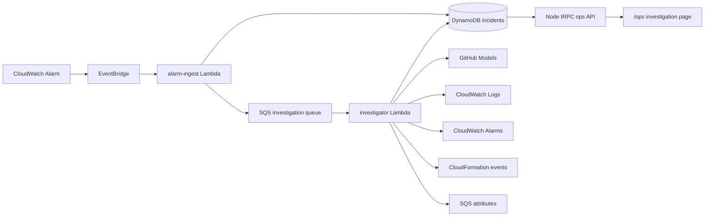

AI Ops Agent 是当前项目的第四阶段运维能力。它建立在已经完成的 CloudWatch
监控、Synthetics、SNS/SQS/DLQ 和灰度发布之上，将告警转换为结构化、可追溯的
只读调查结果。

<Callout title="当前完成状态">
  代码侧 MVP 与部署准备已经完成；AWS stack、GitHub Models Secret、Node server
  云端接入及真实故障演练尚未完成。因此当前不能描述为已经全部上线。
</Callout>

## 架构

## 为什么采用独立 app

Agent 位于 `apps/ai-ops-agent`，与现有 Web、Node Server、Go API 分开构建。共享的
incident、evidence 和 investigation schema 位于 `packages/ai-ops-schema`。

它不是通用运维平台：第一版 resource catalog 只认识本项目的 Node API、Go API、
profile event consumer 和两条 profile event queue。以后可以复用 schema、状态机、
脱敏器和 model adapter，但不能绕过资源白名单直接查询任意 AWS 资源。

## 模型与凭证

- 使用 Mastra 编排，默认模型为 GitHub Models 的 `openai/gpt-4.1`。
- ChatGPT 会员不能替代 API token。
- 独立 GitHub token 只授予 `models:read`，value 保存于 AWS Secrets Manager。
- Lambda 环境变量只保存 Secret ARN 和公开 model ID。
- GitHub Models catalog 内换模型只修改 CloudFormation `AiModel` 参数；换 provider
  时增加 adapter，不需要重写 AWS 工具或 incident schema。

## 只读安全边界

- 模型工具只接收 component/queue enum，不接受 ARN、URL、shell 或任意日志查询。
- 日志先脱敏、截断，再作为 evidence 进入模型。
- 单次调查最多 4 个模型 step、6 次工具调用。
- hypothesis 只能引用真实 evidence ID；证据不足时 `rootCause` 必须为空。
- investigator role 不具备 ECS、Lambda、CloudFormation 或 SQS 修复写权限。
- remediation 只是待人工审批的建议，不会自动执行。

## 成本边界

低频使用时，预计 AWS 增量约为每月 0.40–0.50 美元，主要是一个 Secrets Manager
secret。Lambda、SQS、EventBridge、DynamoDB 和日志按实际使用量计费；该估算不是
费用上限。GitHub Models 超出免费额度时应明确失败或限流，不能静默切换到收费
provider。

## 部署顺序

1. PR 合并到 `master` 后，在 GitHub repository 配置
   `AI_OPS_GITHUB_MODELS_TOKEN`。
2. 手工创建并审查 deployer policy Change Set，再单独执行。
3. 通过 workflow 创建或更新 Secrets Manager secret。
4. 创建并审查 AI Ops Agent Change Set，再单独执行。
5. 将 Agent stack 输出接入 Node server stack。
6. 完成手工调查、告警状态变化、DLQ 和凭证泄漏检查。

部署使用 GitHub Actions OIDC 短期凭证，不使用账号 root。对应入口是
`.github/workflows/ai-ops-change-set.yml`，它只允许手工触发，不会因普通 push
自动创建 AWS 资源。

## 进一步阅读

- 实现、模型、AWS 盘点、费用与验证记录：`apps/ai-ops-agent/README.md`
- 需求与设计：`specs/6.ai-ops-agent/`
- 云端操作与故障处理：`infra/RUNBOOK.md`
- 所有阶段的图示：[架构图总览](/docs/deployment/architecture-gallery)
