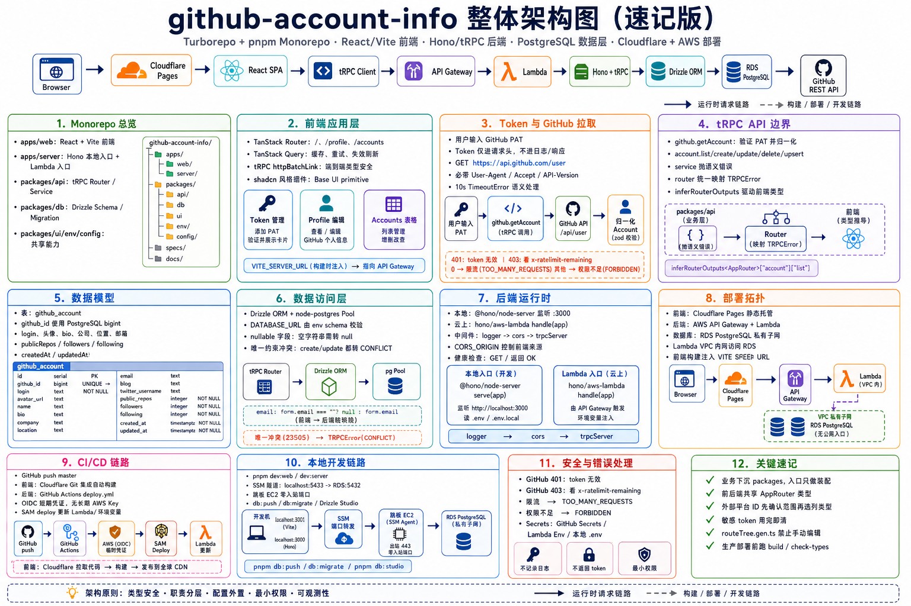
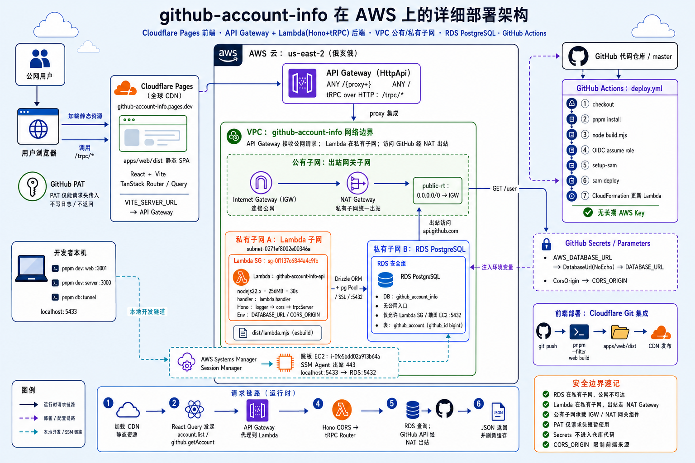
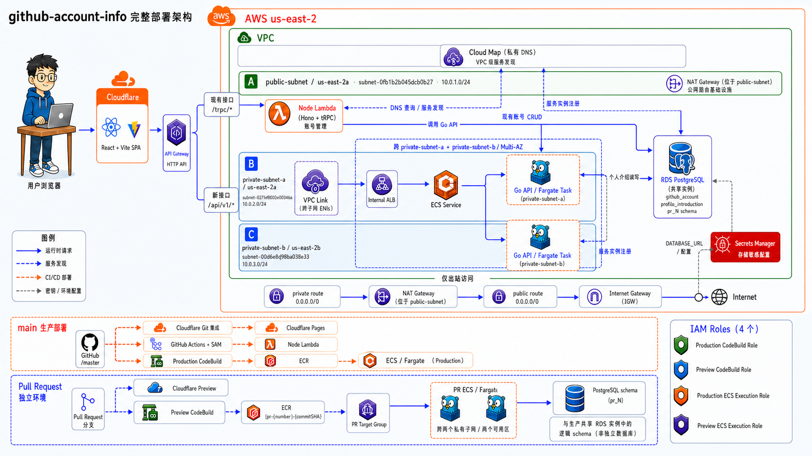
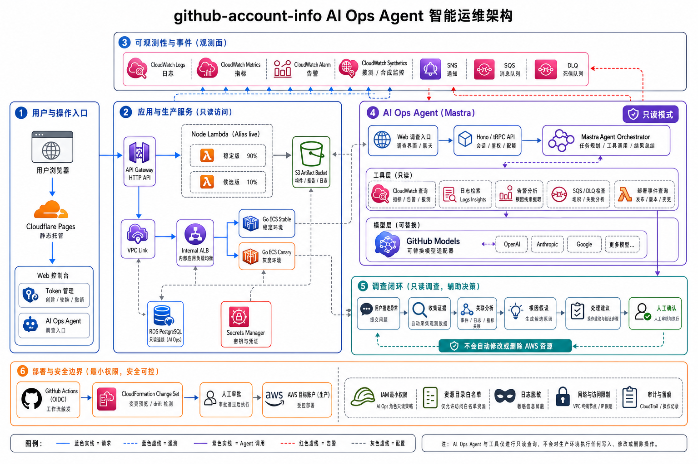

这里按需求开发顺序收录项目部署文档中的架构图：先建立 Node/Lambda 基础，
再加入 Go 平台、PR Preview、稳定性能力，最后在只读监控证据上增加 AI Ops Agent。
早期图片用于解释演进过程，不应单独作为当前环境的部署依据。

## Node/Lambda 初始部署

### 早期架构速记图

**适合回答：最初的 Node 部署由哪些模块组成？**

### Node/Lambda 整体架构

**适合回答：浏览器、Cloudflare Pages、API Gateway、Lambda 和 RDS 的主链路是什么？**

[查看可缩放的 SVG 原图](./node-lambda/assets/architecture.svg)

### Node/Lambda AWS 资源与部署链路

**适合回答：Node 服务在 AWS 内部由哪些资源组成，SAM 和 GitHub Actions 如何完成部署？**

## Go 个人主页平台

**适合回答：新增 Go 服务的请求具体怎么走？Lambda、Go 服务和数据库之间是什么关系？**

这张图聚焦 Go profile platform，详细标出了公网读取、Lambda 内部写入、ECS
服务发现、数据库访问和监控链路。

[查看可缩放的 SVG 原图](./go-service/assets/go-profile-platform.svg)

## 核心部署与 PR Preview

**适合回答：核心请求如何流转，生产 CI/CD 和 PR Preview 环境如何组织？**

这张图包含 Cloudflare Pages、Node Lambda、Go ECS/Fargate、API Gateway、VPC Link、Internal ALB、Cloud Map，以及 production 和 Pull Request preview 两套部署链路。Synthetics、异步事件和灰度发布的细节由下一张可靠性专题图补充。

## 稳定性与异步事件

**适合回答：生产请求如何流转，异步事件如何验证，以及 Node 和 Go 服务如何灰度发布与监控？**

这张图聚焦生产运行时、Synthetics 主动巡检、个人介绍发布验证、DLQ 与告警，以及 Node Lambda 和 Go ECS 的灰度发布。它不展开 Pull Request preview、独立 preview schema 和 IAM Roles；需要这些资源时请查看上面的完整部署架构。

## AI Ops Agent

**适合回答：告警如何转成只读调查，模型能够读取哪些证据，结论保存在哪里？**

第一版 Agent 只有调查权限，没有 ECS、Lambda、CloudFormation 或 SQS 修复写权限。
图中同时标出了现有生产服务、可观测性证据、Mastra 调查编排、GitHub Models
适配层、人工确认闭环，以及 GitHub Actions OIDC 和最小权限安全边界。

## 怎么选择要看的图

| 想了解的问题 | 推荐查看 |
| --- | --- |
| 最早的 Node/Lambda 请求和部署 | Node/Lambda 初始部署 |
| Go 请求、ECS 和内部网络链路 | Go 个人主页平台 |
| 核心运行、生产 CI/CD 与 PR Preview | 核心部署与 PR Preview |
| Synthetics、事件队列、灰度发布与监控 | 稳定性与异步事件 |
| 告警、证据、模型和调查结果 | AI Ops Agent |
| 当前项目的主要部署形态 | 核心部署与 PR Preview + 稳定性与异步事件 + AI Ops Agent |
