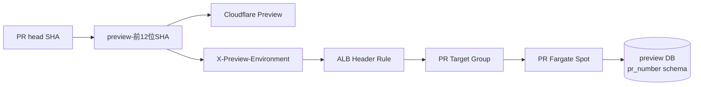

## 本阶段目标

每个经过审批的 Pull Request 获得一套可访问、可并发、关闭后自动清理的临时环境，同时复用昂贵的 VPC、RDS、ECR、Cluster、ALB 和 API Gateway。



## 1. 认识共享和隔离资源

| 复用 | 每个 PR 独立 |
| --- | --- |
| VPC、私有子网、NAT | CloudFormation stack |
| RDS instance 与 preview database | `pr_<number>` schema |
| ECR repository、ECS Cluster | SHA image tag、Task Definition、Service |
| Internal ALB、API Gateway | Target Group、Header Listener Rule |
| Preview Execution/CodeBuild Role | Preview key、Cloudflare deployment |

复用降低成本；独立 route、Service 和 schema 允许两个 PR 同时验证且不串流量。

## 2. Preview key 契约

仓库中的 `@github-account-info/preview-environment` 接收完整 commit SHA，生成：

```text
preview-<前12位lowercase SHA>
```

CodeBuild 使用 `CODEBUILD_RESOLVED_SOURCE_VERSION`，Cloudflare 使用 `CF_PAGES_COMMIT_SHA`。两边必须使用同一个共享实现，不能各自手写截取规则。

PR number 用途不同：

- Stack：`github-account-info-go-pr-<number>`。
- Schema：`pr_<number>`。
- ALB listener priority：PR number，范围 1～49999。
- Image：`pr-<number>-<完整SHA>`。

## 3. Cloudflare Pages 配置

在 Cloudflare Pages 项目设置：

```text
Production branch: master
Build command: pnpm --filter web build
Build output directory: apps/web/dist
VITE_SERVER_URL: production API Gateway base URL
VITE_GO_API_URL: production API Gateway base URL
```

Cloudflare 自动提供 `CF_PAGES_BRANCH` 和 `CF_PAGES_COMMIT_SHA`。不要在 Dashboard 手工写固定 `VITE_PREVIEW_KEY`，否则新 commit 仍会请求旧 Target Group。

生产 branch 不发送 preview header。Preview build 打开根路径时跳转到 `/u/preview-user`，只有 Go public GET 携带 `X-Preview-Environment`。

## 4. 审查 Preview CodeBuild webhook

打开 CodeBuild project 的 webhook filter，预期：

- create/update/reopen：base ref 必须是 master，并受路径过滤。
- merged/closed：base ref 必须是 master，不受部署路径过滤阻止清理。
- `RequiresCommentApproval=ALL_PULL_REQUESTS`。
- approver 必须具有 GitHub write/maintain/admin 角色。

Approval 是执行 PR 代码前的信任门。Preview Task 虽拿不到 production Secret，但共享 preview credential 不是恶意多租户隔离，因此不能自动执行不可信 fork 代码。

## 5. 理解 PRE_BUILD 的输入验证

CodeBuild 验证：

```text
CODEBUILD_SOURCE_VERSION = pr/<1..49999>
CODEBUILD_RESOLVED_SOURCE_VERSION = 完整40位 head SHA
```

不要使用 `git rev-parse HEAD^2` 推导 head SHA：CodeBuild 的 checkout 形态不保证存在预期 merge parent。也不要依赖一个 BuildSpec command 中的 `BASH_REMATCH`在下一个 command 继续存在；每条 command 可能处于独立 shell 上下文。

当前实现直接去掉已验证的 `pr/` 前缀得到 PR number，再独立验证数字范围。

## 6. Preview build 和镜像

部署事件执行与 production 相同的：

```text
gofmt → go mod verify → go vet → go test
→ docker build linux/amd64 → non-root check
→ ECR push → digest verify → image-ready marker
```

生成：

```text
ImageTag = pr-<PR_NUMBER>-<FULL_HEAD_SHA>
PreviewKey = preview-<FIRST_12_SHA>
ExpiresAt = 当前 UTC + 7 天
```

只有 build succeeding 且 marker 存在，才进入部署。

## 7. 安全部署的两阶段顺序

Preview 不是一次直接创建可路由 Service，而是：

```text
deploy_stack RoutingEnabled=false DesiredCount=0
→ run preview-db create
→ 确认 database task exit_code=0
→ deploy_stack RoutingEnabled=true DesiredCount=1
→ wait ECS stable
→ 带 preview header smoke test
```

第一阶段只创建安全态 stack 与 database task definition，没有 Listener Rule、运行 Task 或公开流量。如果 schema 初始化失败，PR 环境仍不可路由。

重试也必须先回到 `false/0`，不能让上一次半成品 Service 在 database 修复前继续暴露。

## 8. Preview database task

CodeBuild 使用 ECS `run-task`执行：

```text
/preview-db create --pr-number <NUMBER>
```

Task 使用 preview Secret、私有子网、Go Task SG 和 `AssignPublicIp=DISABLED`。它创建 `pr_<number>` 结构并写入非敏感 `preview-user` seed。CodeBuild 等待 Task stopped，并要求 container exit code 为 0。

Schema 名由受信任的 PR number 构造，不来自 HTTP。删除时还必须传入精确确认值：

```text
/preview-db drop --pr-number <NUMBER> --confirm-schema pr_<NUMBER>
```

## 9. Header 路由

每个 PR rule 同时要求：

```text
X-Preview-Environment = preview-<12位SHA>
```

匹配后转发到该 PR Target Group。无 header 时不会进入 PR target，仍按 production path rule 处理；错误 preview header 不能回退到另一个 PR。

Preview header 不是认证。知道值的人可以请求对应 preview route，因此 preview 数据只能是虚构或非敏感数据。

## 10. 验证单个 PR

从 CodeBuild 记录 Preview key，执行：

```bash
curl --fail \
  --header 'X-Preview-Environment: preview-<12_HEX>' \
  https://<API_ID>.execute-api.us-east-2.amazonaws.com/healthz

curl --fail \
  --header 'X-Preview-Environment: preview-<12_HEX>' \
  https://<API_ID>.execute-api.us-east-2.amazonaws.com/api/v1/github-users/preview-user/introduction
```

再确认：

- Stack 为 complete。
- Service 使用 `FARGATE_SPOT`，running/pending 为 `1/0`。
- Target healthy。
- Task Definition 的 `DB_SCHEMA=pr_<number>`。
- Listener Rule priority 等于 PR number，header 等于 preview key。
- Cloudflare Preview URL 返回 200。

## 11. 验证两个 PR 不串流量

同时创建两个受控 PR，分别记录 key A/B：

1. A header 和 B header 都应返回 200。
2. 两个响应结构相同，但 seed 内容摘要应不同。
3. 不带 header 的 `preview-user` 应在 production 返回 404。
4. A/B 的 Listener Rule、Target Group、Service 和 `DB_SCHEMA` 必须不同。
5. 两个 Cloudflare Preview deployment URL 都可独立打开。

验证内容差异时可以比较 SHA-256，不需要把完整个人介绍写到日志。

## 12. PR close/merge 清理顺序

```text
deploy_stack RoutingEnabled=false DesiredCount=0
→ Listener Rule/Service 安全移除
→ preview-db drop + 精确 schema confirmation
→ delete PR CloudFormation stack
→ wait stack delete complete
```

先断流量再删 schema。若顺序反过来，运行中的 Task 可能在 schema 消失后持续返回 500。

清理后确认：

- PR stack 不存在。
- ECS 没有对应 `-pr-<number>` Service。
- ALB 没有对应 priority rule/Target Group。
- `pr_<number>` schema 不存在。
- production `/healthz` 仍为 200。

## 本阶段完成标准

- [ ] Cloudflare 与 CodeBuild 从同一完整 head SHA 生成相同 preview key。
- [ ] PR 代码需要授权协作者审批后才能执行。
- [ ] Stack 先以不可路由 `false/0` 创建。
- [ ] Database task exit 0 后才启用路由和 Service。
- [ ] 两个并发 PR 的 header、Target、Service 和 schema 完全隔离。
- [ ] 不带 header 不会访问 preview 数据。
- [ ] close/merge 会先断流量，再删除 schema 和 stack。
