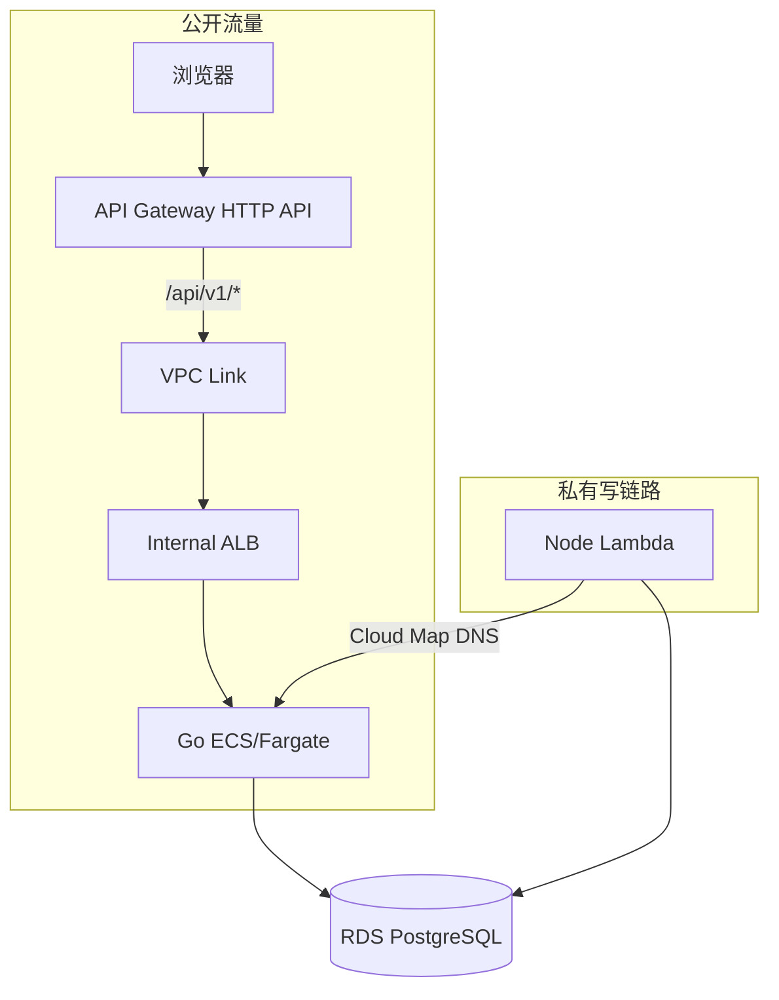
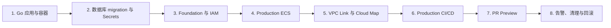

这组笔记记录项目如何在保留 Node Lambda 的同时，引入 Go API、ECS/Fargate、
Internal ALB、Cloud Map、Production CI/CD 和每个 PR 的 Preview 环境。它是一套
按真实依赖顺序组织的容器平台实施手册。

<Callout title="当前记录范围">
  Go 应用、数据库与 Secret、共享网络、Production ECS、VPC Link、Cloud Map、
  CI/CD、PR Preview、监控、清理和排障分别记录在后续十章。每章的“完成标准”用于
  核对阶段结果；云上实时状态仍以 CloudFormation、ECS、ALB 和 CodeBuild 为准。
</Callout>

## 先看结论

1. Go 服务不是重写 Node，而是用渐进式拆分接管个人介绍能力。
2. ECS/Fargate 用来运行容器，不用维护 EC2，也没有引入当前规模不需要的 Kubernetes。
3. 公开请求经 API Gateway、VPC Link 和 Internal ALB 进入 Go。
4. Node Lambda 的内部写请求经 Cloud Map 找到动态变化的 Go Task。
5. Production 使用不可变 SHA 镜像；PR Preview 隔离路由、服务和数据库 schema。
6. CloudFormation 是基础设施事实来源，变更先创建 Change Set、审查后再执行。

## 最终目标

Go 服务不是 Node 服务的全量替代，而是通过 strangler pattern 接管一个边界清晰的新能力：根据数据库中已经保存的 GitHub 账号资料生成个人介绍，并提供公开读取接口。




## 为什么不是 Lambda 或 Kubernetes

| 方案 | 结论 | 原因 |
| --- | --- | --- |
| 第二个 Lambda | 未选择 | 无法完整练习容器、Service、负载均衡、服务发现和滚动发布 |
| ECS/Fargate | 选择 | 不管理 EC2，仍能学习标准容器生产链路，与现有 VPC/RDS 容易衔接 |
| EKS/Kubernetes | 未选择 | 当前只有一个 Go 服务，引入集群控制面和 Kubernetes 运维复杂度过高 |

Internal ALB 与 API Gateway VPC Link 的组合让 Go Task 保持私网部署；Cloud Map 则解决 Lambda 到动态 Task IP 的内部服务发现。这两个入口服务不同的调用者，不互相替代。

## 实施阶段与依赖



不能随意交换顺序：ECS 在启动时需要 ECR、网络、Execution Role 和 Secret；API Gateway 私有集成需要已经存在的 ALB listener；CodeBuild 又必须引用已经验收的 production 模板和 IAM 边界。

## 开始前准备

### 本地工具

```bash
node --version
pnpm --version
go version
docker version
aws --version
sam --version
git --version
```

项目当前以仓库锁定的版本、Dockerfile 中固定 digest 的 Go builder 和 `pnpm-lock.yaml` 为准。不要因为本机安装了更新版本就顺手升级生产 toolchain。

### AWS 前置资源

开始云端阶段前，应已经有：

- 一个包含至少两个 AZ 私有子网的 VPC。
- 私网 RDS PostgreSQL 与对应安全组。
- Node Lambda 及其安全组。
- 私有子网到 ECR、Logs、Secrets Manager 的 NAT 出口或 VPC endpoints。
- 能创建 CloudFormation change set 的 AWS 身份。

### 安全约定

<Callout type="warn" title="Secret 不进入教程和命令历史">
  文档只记录 Secret ARN、资源状态和脱敏输出。完整 DATABASE_URL、数据库密码、GitHub PAT、Cloudflare token 和 AWS access key 都不得粘贴到终端参数、聊天或 Git。
</Callout>

- CloudFormation 是基础设施事实来源；Console 用于观察和授权，不手工制造长期漂移。
- 先创建 change set，查看资源变化，再执行。
- 镜像使用 `prod-<完整 Git SHA>` 或 `pr-<number>-<完整 SHA>`，禁止复用可变 `latest`。
- production 与 preview 使用不同数据库凭证。
- preview header 只负责路由，不是认证。

## 如何使用后续章节

每章都先说明本阶段目标，再给出操作、成功信号、失败处理和完成标准。这与其他四个
模块的“结论 → 架构 → 实现 → 部署 → 验收 → 排障”主线一致，只是 Go 涉及的资源
更多，因此拆成多页。

第一次搭建时按左侧顺序执行；以后复习时可先看每章的“完成标准”。线上紧急故障以
`infra/RUNBOOK.md` 的当前命令为准，本教程用于理解为什么要执行它们。
