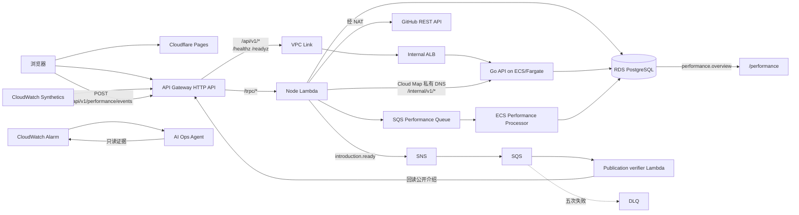
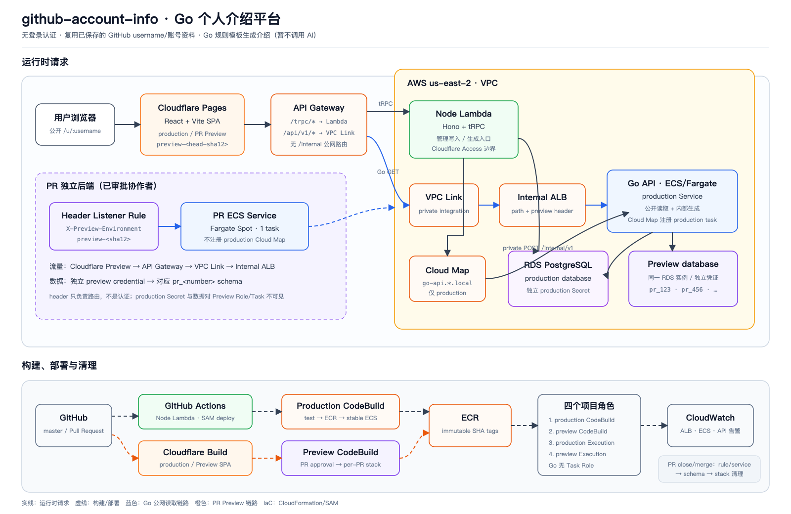

## 最终架构

项目采用渐进式拆分，而不是一次性重写：原 Node Lambda 继续负责账号管理、GitHub PAT 调用和 tRPC；Go 服务负责个人介绍生成、保存和公开读取。





## 三条业务请求链路

### 账号管理

```text
浏览器 → API Gateway /trpc/* → Node Lambda → GitHub API / RDS
```

GitHub PAT 只存在于浏览器到 Node Lambda 的请求头中。Go 服务永远不接收 PAT，也不会重新调用 GitHub 获取用户名。

### 生成个人介绍

```text
浏览器 → tRPC mutation → Node Lambda
       → Cloud Map: go-api.github-account-info.local:8080
       → Go POST /internal/v1/introductions → RDS
```

内部写接口没有配置到 API Gateway，因此公网不存在 `/internal/*` route。Cloud Map 提供稳定服务名，ECS Task 更换私有 IP 后，Lambda 不需要更新配置。

### 公开读取个人介绍

```text
浏览器 → API Gateway /api/v1/* → VPC Link
       → Internal ALB → Go ECS Task → RDS
```

Internal ALB 没有公网地址。API Gateway 是公开入口，VPC Link 负责进入 VPC。

### 浏览器性能采集与统计

```text
浏览器 Performance SDK
  → POST /api/v1/performance/events
  → API Gateway → Node/Hono Lambda → SQS
  → ECS Performance Processor → PostgreSQL
  → tRPC performance.overview → /performance
```

浏览器不持有 AWS 凭证。Lambda 只完成大小限制、契约校验和入队；ECS 是唯一清洗
边界，PostgreSQL 是页面在线统计数据源。核心真实链路已经完成验收；当前准实时
方案使用一个常驻 Processor 和页面 10 秒后台回读，0→1→0 保留为低成本模式。

## 部署链路

| 目标 | 触发方式 | 构建平台 | 最终产物 |
| --- | --- | --- | --- |
| Web production/preview | Git push / Pull Request | Cloudflare Pages | Vite 静态资源 |
| Node Lambda | master 指定路径变更 | GitHub Actions + SAM | Lambda bundle 与 API 配置 |
| Go production | master 指定路径变更 | AWS CodeBuild | ECR SHA 镜像 + ECS revision |
| Go PR preview | PR 生命周期事件 | AWS CodeBuild | 独立 schema、Target Group、ECS Service 与 ALB rule |
| Performance processor | reviewed Change Set / immutable image | GitHub Actions OIDC + ECR | 独立 ECS Service 与可缩容消费链路 |

Node production 由 Lambda `live` alias 原生权重执行 10% 流量、观察 5 分钟、再切到 100%；Go production 的公网 ALB 链路由独立 Canary Service 与 Target Group 权重执行相同策略。只有稳定 Go Service 注册 Cloud Map，因此 Node → Go 内部调用不参与公网灰度。

## 五大模块怎么读

五组笔记都遵循同一条阅读主线：

```text
先看目标和结论 → 理解架构与职责 → 按真实顺序看实现
→ 理解 AWS 部署 → 核对验收状态 → 用排障和代码导读复习
```

内容较短的模块在一个页面中完成这条主线；Go 服务涉及容器、数据库、网络、CI/CD
和 PR Preview，因此按同样顺序拆成十章。拆页只控制单页长度，不改变阅读逻辑。

| 模块 | 白话目标 | 推荐入口 |
| --- | --- | --- |
| Node Lambda 部署 | 把本地 Node/Hono API 安全地放到 Lambda，并连接私有 RDS | [Node Lambda 部署实录](/docs/deployment/node-lambda) |
| Go 服务部署 | 在不重写 Node 的前提下，引入一条完整 ECS/Fargate 容器链路 | [Go 服务部署与容器平台](/docs/deployment/go-service) |
| 稳定性与异步事件 | 主动巡检、异步验证，并让 Node 和 Go 支持受控灰度 | [稳定性巡检、事件队列与灰度发布](/docs/deployment/operations-reliability) |
| AI Ops Agent | 自动收集只读证据，生成可追溯、需人工审批的调查报告 | [AI Ops Agent 调查闭环](/docs/deployment/ai-ops-agent) |
| 性能监控与可视化 | 从真实浏览器采集性能，经异步清洗后展示统计结果 | [性能 SDK、异步清洗与可视化统计](/docs/deployment/performance-observability) |

每篇首次出现的缩写都会先给中文解释；真实故障统一按“现象 → 原因 → 修复 → 教训”
记录。状态统一区分代码完成、部署准备、云端部署和真实链路验收，避免把
“本地测试通过”误写成“生产已经上线”。

## 其他入口

- 想直观看完整系统或对比历史版本：打开
  [架构图总览](/docs/deployment/architecture-gallery)。
- 操作 Go production：按 Go 教程左侧顺序阅读，不要直接跳到 CodeBuild。
- 线上故障：先看对应模块的排障章节，再按 `infra/RUNBOOK.md` 执行当前命令。
