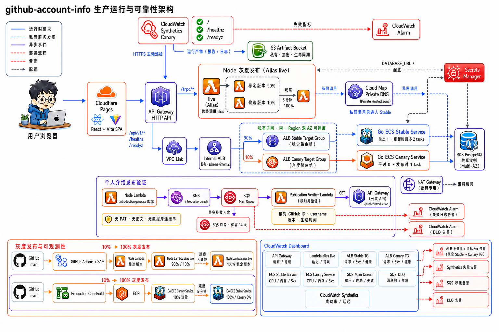
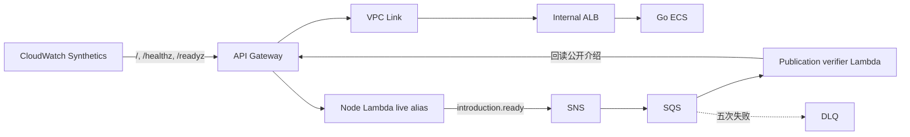

## 实现范围

这组能力直接复用现有业务链路：





| 能力 | 配置文件 | 核心行为 |
| --- | --- | --- |
| 公开 API 巡检 | `infra/synthetics.yaml` | 创建后立即启动，每 15 分钟检查三个路由 |
| 异步发布验证 | `infra/profile-events.yaml` | SNS → SQS → Lambda 回读公开 API，五次失败进 DLQ |
| Node 灰度 | `apps/server/deploy-canary.sh` | Lambda `live` alias 原生权重，10% 观察 5 分钟后 100% |
| Go 公网灰度 | `infra/go-production.yaml` | 稳定/Canary 双 Service 与双 Target Group，10%/5 分钟 |

## 事件内容与安全边界

`introduction.ready` 只包含事件 ID、GitHub 公共 ID/username、生成器版本、生成时间和是否新生成。PAT、数据库连接串和介绍正文都不会进入 SNS/SQS。consumer 逐条校验消息，再调用 `/api/v1/github-users/{username}/introduction` 核对 GitHub ID、username、生成器版本和生成时间。单条失败只返回该 record 的 partial batch failure，不会拖累同批有效消息。

Topic 使用 SNS 的 AWS 托管密钥加密；主队列和 DLQ 使用 `SqsManagedSseEnabled`（SSE-SQS）静态加密。SSE-SQS 只改变 SQS 的加密密钥管理方式，不会绕过 SNS，消息链路仍是 SNS → SQS。这里不使用 `alias/aws/sqs`：该 AWS 托管 KMS key 的策略不能为 SNS 授予投递加密队列所需的 KMS 权限；若改用 customer managed KMS key 虽可授权 SNS，但会增加密钥管理与固定费用。

`PROFILE_EVENTS_TOPIC_ARN` 未配置时 publisher 是 no-op，方便本地开发。云端启用后，Node Lambda 只获得对该 Topic 的 `sns:Publish`。

## 完整实现过程

下面按代码真正落地的先后顺序说明。顺序很重要：先定义事件边界，再创建消费者和队列，最后才让生产 Node 开始发布；这样部署过程中不会出现“生产者已经发送，但下游还不存在”的消息空窗。

### 第一步：定义共享事件契约

在 `packages/events/src/profile-event.ts` 中用 Zod 定义 `introduction.ready`：

```ts
export const profileEventSchema = z.object({
  eventId: z.string().min(1).max(256),
  eventType: z.literal("introduction.ready"),
  schemaVersion: z.literal(1),
  githubId: z.number().int().nonnegative(),
  githubUsername: z.string().min(1).max(39),
  generatorVersion: z.string().min(1).max(64),
  generatedAt: z.iso.datetime({ offset: true }),
  generated: z.boolean(),
});
```

`eventId` 由事件类型、GitHub ID、生成器版本和生成时间确定性拼接。同一个业务结果重发时仍可识别为同一事件。契约放在独立 workspace package 中，Node publisher 和 verifier 共用同一份 schema，避免两边手写不同的 JSON 类型。

### 第二步：在介绍生成成功后发布事件

`packages/api/src/services/profile-events.ts` 封装 `ProfileEventPublisher`，内部使用 AWS SDK v3 的 `SNSClient` 和 `PublishCommand`。发布时只传 Topic ARN、事件 JSON 和 `eventType` message attribute：

```ts
await client.send(
  new PublishCommand({
    TopicArn: topicArn,
    Message: JSON.stringify(event),
    MessageAttributes: {
      eventType: { DataType: "String", StringValue: event.eventType },
    },
  }),
);
```

介绍路由先等待 Go 返回并保存结果，再调用 publisher。SNS 失败会转换成业务层的 `ProfileEventPublisherError`，不会把 AWS SDK 原始异常返回给浏览器。启动时根据 `PROFILE_EVENTS_TOPIC_ARN` 选择实现：

- 有 ARN：创建真实 SNS publisher。
- 没有 ARN：注入 no-op publisher，本地开发不依赖 AWS。

`apps/server/template.yaml` 同步完成两件事：把 `PROFILE_EVENTS_TOPIC_ARN` 注入 Lambda 环境变量，并只授予该 Topic 的 `sns:Publish`。没有给 Lambda `sns:*` 或所有 Topic 的通配权限。

### 第三步：创建 SNS、主队列和 DLQ

`infra/profile-events.yaml` 独立管理整条异步链路：

1. 创建 `github-account-info-profile-events` SNS Topic，并使用 `alias/aws/sns` 静态加密。
2. 创建主队列，设置 SSE-SQS、90 秒 visibility timeout、4 天保留和 20 秒 long polling。
3. 创建 DLQ，设置 SSE-SQS 和 14 天保留。
4. 在主队列 `RedrivePolicy` 中指定 DLQ，并设置 `maxReceiveCount: 5`。
5. 创建 SQS resource policy，只允许当前账号中的这个 SNS Topic 执行 `sqs:SendMessage`。
6. 创建 SNS subscription，设置 `RawMessageDelivery: true`，让 consumer 直接收到事件 JSON，而不是再拆一层 SNS envelope。

核心关系如下：

```yaml
ProfileEventsQueue:
  Type: AWS::SQS::Queue
  Properties:
    SqsManagedSseEnabled: true
    VisibilityTimeout: 90
    RedrivePolicy:
      deadLetterTargetArn: !GetAtt ProfileEventsDeadLetterQueue.Arn
      maxReceiveCount: 5

ProfileEventsSubscription:
  Type: AWS::SNS::Subscription
  Properties:
    TopicArn: !Ref ProfileEventsTopic
    Protocol: sqs
    Endpoint: !GetAtt ProfileEventsQueue.Arn
    RawMessageDelivery: true
```

这里曾使用 `alias/aws/sqs`，实际测试发现 SNS 无法获得该 AWS 托管 KMS key 的 `GenerateDataKey`/`Decrypt` 权限，消息能发布到 Topic 却进不了队列。最终改为 SSE-SQS：仍然静态加密，同时不需要额外购买和维护 customer managed KMS key。

### 第四步：实现 publication verifier

`apps/profile-event-consumer/src/lambda.ts` 是 SQS consumer。每条 record 依次执行：

1. 解析 `record.body`。
2. 使用共享 `profileEventSchema` 校验版本、字段和 GitHub username。
3. 请求公开接口 `/api/v1/github-users/{username}/introduction`。
4. 比对 GitHub ID、username、generator version 和 generated time。
5. 完全一致才确认消息；404、5xx、超时、非法 JSON 或字段不一致均返回失败 record ID。

Lambda event source 开启 `ReportBatchItemFailures`：

```yaml
Events:
  ProfileEvents:
    Type: SQS
    Properties:
      Queue: !GetAtt ProfileEventsQueue.Arn
      BatchSize: 10
      MaximumBatchingWindowInSeconds: 5
      FunctionResponseTypes:
        - ReportBatchItemFailures
```

因此一批 10 条消息中只有坏消息会重试，成功消息不会跟着重复消费。函数日志保留 14 天；主队列 oldest message 达到 5 分钟触发积压告警，DLQ 出现 1 条消息立即触发 DLQ 告警。

### 第五步：创建 Synthetics 巡检

`infra/synthetics.yaml` 一次创建四类资源：

1. 私有 S3 artifact bucket：开启 AES-256、阻止全部公网访问、30 天生命周期清理。
2. Canary execution role：只能写指定 bucket 路径、写 CloudWatch 指标/日志和 X-Ray telemetry。
3. `github-info-api` Canary：使用 `syn-nodejs-puppeteer-11.0`，默认创建后启动，周期为 15 分钟。
4. `github-account-info-synthetics-api-failed` 告警：五分钟内出现一次失败即进入 `ALARM`。

Canary 脚本把三个路由拆成独立 step：

```js
const checks = [
  { name: "node-root", path: "/", expectedText: "OK" },
  { name: "go-liveness", path: "/healthz", expectedStatus: "ok" },
  { name: "go-readiness", path: "/readyz", expectedStatus: "ready" },
];
```

每个 step 都要求 HTTP 200，并继续检查响应正文，而不是只证明 DNS 或 TCP 可以连通。`/healthz` 覆盖 Go 进程与公网路由，`/readyz` 继续覆盖数据库 readiness。

### 第六步：实现 Node Lambda 灰度

API Gateway 的 Node integrations 和 `AWS::Lambda::Permission` 全部指向 `${ApiFunction.Arn}:live`。这是灰度生效的前提；如果 API Gateway 直接调用函数 ARN或 `$LATEST`，alias 权重不会作用到真实请求。

`.github/workflows/deploy.yml` 把数据库连接串从 Secret 注入，把 `PROFILE_EVENTS_TOPIC_ARN` 从 repository variable 注入，然后执行 `apps/server/deploy-canary.sh`。脚本按以下顺序工作：

1. 读取当前 `live` alias 指向的稳定版本；第一次运行时先 publish 当前 `$LATEST` 作为 baseline 并创建 alias。
2. 执行 `sam deploy`，只更新 `$LATEST`、API 配置和 IAM；线上流量仍指向稳定版本。
3. 等 Lambda 更新完成后 publish candidate version。
4. 把 `live` 设置为稳定版本 90%、candidate 10%。
5. 连续 10 个 30 秒窗口请求 `/`、`/healthz`、`/readyz`，每次请求最多重试三次。
6. 五分钟全部通过后，把 `live` 100% 指向 candidate 并清空 `AdditionalVersionWeights`。
7. 任一窗口失败，立即清空权重并把 `live` 恢复到稳定版本。

若 SAM 明确返回 Stack 已是最新状态，脚本不会强制创建不存在的 candidate；它会保留
当前 `live` alias，验证 `/`、`/healthz`、`/readyz` 后把本次空部署记为成功。

该账号暂时无法使用 CodeDeploy，因此这里直接使用 Lambda alias 原生权重；灰度行为仍完全由版本和 alias 控制。

> **为什么 CodeDeploy 不可用**
>
> 2026-07-28 使用账号 root 凭证分别在 `us-east-1` 和 `us-east-2` 调用只读接口
> `codedeploy:ListApplications`，均返回
> `SubscriptionRequiredException: The AWS Access Key Id needs a subscription for the service`。
> 两个 Region 都是 `ENABLED_BY_DEFAULT`，并且 root 不受普通 IAM Allow 缺失影响，
> 因此这不是部署角色权限、Region opt-in 或 CloudFormation 模板问题。
>
> `freetier:GetAccountPlanState` 进一步确认该账号的 `accountPlanType` 为 `FREE`。
> 这是 2025-07-15 后新版 AWS Free Tier 的 Free account plan：它只允许访问部分
> AWS 服务和功能。AWS 官方要求升级到不可降级的 `PAID` account plan，才能立即
> 访问全部 AWS 服务和功能，包括当前被计划限制的 CodeDeploy。升级后剩余 Free
> Tier credits 会继续自动抵扣符合条件的费用，直到 credits 到期；credits 用尽或
> 使用不适用 credits 的服务后，将按标准 pay-as-you-go 价格向付款方式收费。
>
> 官方说明：[Choosing an AWS Free Tier plan](https://docs.aws.amazon.com/awsaccountbilling/latest/aboutv2/free-tier-plans.html)；
> [AWS Free Tier FAQs](https://aws.amazon.com/free/free-tier-faqs/)。
>
> 若以后决定开启，应先确认预算和付款方式，再在 Billing 控制台选择
> **Upgrade plan → Upgrade account**，或显式执行
> `aws freetier upgrade-account-plan --account-plan-type PAID --region us-east-1`。
> 这是整个账号的计费计划升级，不是单独为 CodeDeploy 打开的服务开关。升级后先用
> `aws deploy list-applications --region us-east-2` 验证 entitlement，再决定是否
> 把现有 Lambda alias 灰度迁回 CodeDeploy。

### 第七步：实现 Go 公网灰度

原生产 Service 已注册 Cloud Map，而 ECS 原生 Canary strategy 不支持带 Service Registry 的 Service。最终在 `infra/go-production.yaml` 中拆成两个 Service：

- Stable Service：平时 1 个 Task，保留 Cloud Map，deployment strategy 继续使用 Rolling。
- Canary Service：独立 TaskDefinition 和 Target Group，不注册 Cloud Map，平时 `DesiredCount=0`，发布时临时启动 1 个 Task。

ALB listener rule 使用 `ForwardConfig` 同时引用两个 Target Group，权重由 `StableTrafficWeight` 和 `CanaryTrafficWeight` 参数控制。`infra/scripts/deploy-go-production.sh` 执行四个阶段：

1. **90/10 观察**：稳定 Service 保持旧镜像，Canary 运行新镜像并接收 10% 公网流量；等待 target healthy 后观察五分钟。
2. **0/100 隔离**：公开流量暂时全部交给已验证的 Canary，避免稳定 Service Rolling 时新旧版本混流。
3. **稳定版本晋级**：Stable Service 更新为新镜像并执行 Rolling；Node → Go 的 Cloud Map 内部链路只经过这里。
4. **100/0 收口**：公网切回 Stable Target Group，Canary 缩容为 0，但保留 Service 和 Target Group 供下次发布复用。

任一阶段失败都会重新部署上一 `prod-&lt;sha&gt;`、恢复稳定权重 100%、Canary 权重 0 并缩容 Canary。因为只有 Stable Service 注册 Cloud Map，Node 内部生成调用不会误入尚未验证的 Canary。

### 第八步：补齐部署权限与仓库变量

新增资源后同步收紧两条部署权限：

- `infra/server-deployer-policy.yaml`：允许现有 GitHub deployer 管理 API access logs、CloudWatch alarms、Lambda version 与 alias，但不授予 CodeDeploy。
- `infra/go-iam.yaml`：Production CodeBuild 只可更新明确命名的 Stable/Canary Service、TaskDefinition 和 Target Group。

`profile-events` Stack 创建后，从 Outputs 读取 `ProfileEventsTopicArn`，然后同时配置到：

1. server Stack 的 `ProfileEventsTopicArn` 参数；
2. GitHub 仓库 `Settings → Secrets and variables → Actions → Variables` 下的 `PROFILE_EVENTS_TOPIC_ARN`。

前者让当前 Lambda 立即发布事件，后者保证以后 GitHub Actions 重新部署时仍会把同一个 ARN 传回 CloudFormation。

## AWS 控制台逐项对照

除 IAM 为 Global service 外，下面所有页面先把右上角 Region 切换到 **United States (Ohio) / `us-east-2`**。控制台用于观察和排障，模板仍是配置事实来源；不要在控制台直接修改权重、队列参数、Lambda 环境变量或 ECS Desired count，否则会造成 CloudFormation drift。

### 先从 CloudFormation 找资源

统一入口是 `CloudFormation → Stacks`。进入 Stack 后常用四个标签：

- `Resources`：逻辑 ID、资源类型和可点击的 Physical ID。
- `Outputs`：Topic ARN、Queue URL、Target Group ARN 等跨 Stack 值。
- `Events`：部署失败时从最早出现的具体 `*_FAILED` 查根因。
- `Change sets`：执行前查看 Add、Modify、Remove 和 Replacement。

| Stack | 控制台中负责的内容 |
| --- | --- |
| `github-account-info-profile-events` | SNS、主队列、DLQ、verifier Lambda、两条队列告警 |
| `github-account-info-synthetics` | Canary、artifact bucket、执行角色、Canary 失败告警 |
| `github-account-info` | Node Lambda、HTTP API、VPC Link、API access log 与 5xx 告警 |
| `github-account-info-go-production` | Stable/Canary TaskDefinition、Service、Target Group、Listener Rule 与 ECS/ALB 告警 |
| `github-account-info-go-foundation` | ECS Cluster、ECR、Internal ALB、Cloud Map、VPC 与日志组 |
| `github-account-info-go-iam` | Production/Preview CodeBuild 和 ECS runtime 权限 |
| `github-account-info-server-deployer-policy` | GitHub Actions 部署 Node 所需的 customer managed policy |

### SNS Topic 与订阅

进入 `Amazon SNS → Topics → github-account-info-profile-events`：

- `Details`：确认 Topic ARN 以 `github-account-info-profile-events` 结尾。
- `Encryption`：确认 encryption key 为 `alias/aws/sns`。
- `Subscriptions`：应有一条 `SQS` subscription，状态为 `Confirmed`，Endpoint 指向主队列 ARN。
- 点击 subscription：确认 Raw message delivery 已启用。它对应模板中的 `RawMessageDelivery: true`。

这里发布成功只代表 SNS 接受了消息，不代表 SQS 已收到；完整链路还要继续检查主队列指标或 verifier 日志。

### SQS 主队列

进入 `Amazon SQS → Queues → github-account-info-profile-events`：

- `Details` 或 `Edit → Configuration`：Visibility timeout 应为 `1 minute 30 seconds`，Message retention period 为 `4 days`，Receive message wait time 为 `20 seconds`。
- `Edit → Encryption`：Encryption 应启用，Key type 为 Amazon SQS key（SSE-SQS），而不是 `alias/aws/sqs`。
- `Edit → Dead-letter queue`：应为 Enabled；DLQ 指向 `github-account-info-profile-events-dlq`；Maximum receives 为 `5`。
- `Access policy`：应看到 Principal 为 `sns.amazonaws.com`，Action 为 `sqs:SendMessage`，并通过 `aws:SourceAccount` 和 `aws:SourceArn` 限制到当前 Topic。
- `Monitoring`：`Approximate number of messages visible` 用于看积压，`Approximate age of oldest message` 对应五分钟积压告警。
- `Lambda triggers`：应能看到 `github-account-info-profile-event-consumer`。

不要使用 `Send and receive messages` 手动消费主队列中的正常业务消息；人工轮询会改变 receive count 和 visibility 状态。

### SQS DLQ

进入 `Amazon SQS → Queues → github-account-info-profile-events-dlq`：

- `Details`：Message retention period 应为 `14 days`。
- `Edit → Encryption`：同样应为 SSE-SQS。
- `Monitoring`：故障注入后 `Approximate number of messages visible` 为 1。
- `Send and receive messages → Poll for messages`：可展开测试消息正文和 Attributes；仅查看时不要点击 `Delete`。
- `Start DLQ redrive`：用于问题修复后把消息送回 source queue。执行 redrive 前必须先确认 consumer 已修复，否则消息会再次失败并回到 DLQ。

### Publication verifier Lambda

进入 `Lambda → Functions → github-account-info-profile-event-consumer`：

- `Code`：可查看部署后的 bundle，不在控制台直接编辑。
- `Configuration → Triggers`：选择 SQS trigger，确认状态 Enabled、Batch size 为 `10`、Batch window 为 `5 seconds`。Event source mapping 的 response type 应包含 `ReportBatchItemFailures`。
- `Configuration → Environment variables`：应有 `PUBLIC_API_URL`，值为 API Gateway HTTPS origin；这里不包含数据库 URL 或 PAT。
- `Configuration → Permissions`：execution role 只需要读取和删除主队列消息以及写日志。
- `Monitor → View CloudWatch logs`：进入 `/aws/lambda/github-account-info-profile-event-consumer`，正常消息搜索 `profile publication verified`，失败消息搜索 `profile publication verification failed`。

### Node publisher 与 Lambda Alias 灰度

进入 `Lambda → Functions → github-account-info-api`：

- `Aliases → live`：灰度期间会显示主版本和 Additional version weight `10%`；发布完成后应只指向新版本，Additional version weights 为空。当前验收完成后的版本为 `2`。
- `Versions`：可看到 baseline 和 candidate 两个不可变版本；`$LATEST` 不直接承接公网流量。
- `Configuration → Environment variables`：确认存在 `PROFILE_EVENTS_TOPIC_ARN`。同页包含数据库连接配置，只确认变量名，不复制、截图或输出其值。
- `Configuration → Permissions`：execution role 的 inline policy `publish-profile-events` 应只允许向当前 Topic 执行 `sns:Publish`。
- `Monitor → Metrics`：按 alias 或版本观察 Invocations、Errors、Duration 和 Throttles，判断 10% candidate 是否异常。

进入 `API Gateway → APIs → mdgq1tigyl`：

- `Routes`：`GET /` 和 `/trpc/{proxy+}` 指向 Node；`/api/v1/{proxy+}`、`/healthz`、`/readyz` 指向 Go 的 VPC Link integration。
- `Integrations`：Node integration URI 应包含 Lambda `live` alias；Go integration 应显示 VPC Link 和 Internal ALB listener。
- `Stages → $default`：查看 auto-deploy 和 access logging 设置。
- `CloudWatch → Log groups`：API access log group 中只应出现 request ID、route、status、response length 和 integration error，不应出现 PAT 或请求正文。

### Synthetics、巡检步骤与产物

进入 `CloudWatch → Application Signals → Synthetics Canaries → github-info-api`：

- `Availability`：查看最近运行状态；选择一条 run 后，在 `Steps` 中应看到 `node-root`、`go-liveness`、`go-readiness` 三步。
- run 详情中的 `Logs`、`HAR file` 和 `Traces`：用于区分 DNS、TLS、HTTP 状态、正文校验或后端响应时间问题。
- `Configuration`：Schedule 应为 `rate(15 minutes)`，Runtime 为 `syn-nodejs-puppeteer-11.0`，Active tracing 已启用。
- `Canary artifacts and Amazon S3 location`：点击 S3 链接可进入 artifact bucket。

进入 `Amazon S3 → Buckets → github-account-info-syntheti-canaryartifactsbucket-gj97katwsjur`：

- `Permissions`：Block public access 应全部开启。
- `Properties → Default encryption`：应为 Amazon S3 managed keys（SSE-S3）。
- `Management → Lifecycle rules`：artifact 应在 30 天后过期。

进入 `CloudWatch → Alarms → All alarms`，搜索 `github-account-info-synthetics-api-failed`。正常时为 `OK`；任一 Canary run 的 `Failed` 指标在五分钟内达到 1 就进入 `ALARM`。

### Go Stable/Canary ECS Service

进入 `Amazon ECS → Clusters → github-account-info-go → Services`：

- `github-account-info-go-production`：正常收口后 Desired/Running 为 `1/1`。
- `github-account-info-go-production-canary`：正常收口后 Desired/Running 为 `0/0`；灰度观察期为 `1/1`。
- 分别进入 Service 的 `Deployments`：查看当前 TaskDefinition revision、deployment 状态、失败 Task 和 rollback 记录。
- Service 的 networking/service discovery 信息中，只有 Stable Service 应关联 Cloud Map；Canary Service 不应存在 Service registry。
- `Tasks`：灰度时可分别打开 Stable 和 Canary Task，查看 private IP、health status、container image tag 和日志链接。

进入 `Amazon ECS → Task definitions`：

- Stable family 为 `github-account-info-go-production`；Canary family 为 `github-account-info-go-production-canary`。
- 选择 revision 后在 container definition 中确认 image 使用不可变的 `prod-&lt;sha&gt;`，数据库凭证来自 Secrets Manager，而不是明文 environment value。

### ALB、Target Group 与 90/10 权重

进入 `EC2 → Load Balancing → Load Balancers → github-account-info-go-internal`：

- `Scheme` 应为 `internal`，不能是 internet-facing。
- `Listeners and rules`：打开 listener，再进入 production rule。
- rule conditions 应覆盖 `/api/v1/*`、`/healthz`、`/readyz`。
- rule action 应同时 Forward 到 `github-account-info-go-prod` 和 `github-account-info-go-prod-alt`。
- 灰度观察期权重为 Stable `90` / Canary `10`；最终收口后为 Stable `100` / Canary `0`。

进入 `EC2 → Load Balancing → Target Groups`：

- `github-account-info-go-prod → Targets`：最终应有一个 healthy target。
- `github-account-info-go-prod-alt → Targets`：灰度时应有一个 healthy target；Canary 缩容后为空。
- `Health checks`：两个 Target Group 都通过 `/readyz` 判断是否可以接收流量。

权重只负责分流，不会在某个 Target Group 为空或不健康时自动把流量转给另一个组，因此发布脚本必须先等待 Canary target healthy，再设置或保留 10% 流量。

### Cloud Map 内部调用边界

进入 `AWS Cloud Map → Namespaces → github-account-info.local → Services → go-api`：

- `Service instances`：只应看到 Stable Service 当前 Task 的 private IP。
- Canary Task 即使正在运行，也不应出现在这里。
- Node 的 `GO_API_INTERNAL_URL` 使用 `go-api.github-account-info.local:8080`，因此内部介绍生成直接命中 Stable Service，不经过 API Gateway、VPC Link、ALB 或 Canary Target Group。

### ECR、CodeBuild、IAM 与告警

- `Amazon ECR → Private registry → Repositories → github-account-info-go → Images`：Production 镜像 tag 使用 `prod-&lt;full-git-sha&gt;`；PR 镜像使用 `pr-&lt;number&gt;-&lt;commitSHA&gt;`。
- `CodeBuild → Build projects`：打开 production project 后，在 `Build history` 查看四阶段灰度脚本输出；失败时确认日志是否执行 `Restoring stable image`。
- `IAM → Policies → github-account-info-go-server-observability-deploy`：查看 GitHub Actions 部署 Node 所需的 CloudWatch Logs/Alarm 权限。IAM 是 Global service，不需要切 Region。
- `CloudWatch → Alarms → All alarms`：搜索前缀 `github-account-info`。Go 侧包括 `production-unhealthy-targets`、`production-target-5xx`、`production-no-running-task`、`production-high-cpu`；事件侧包括 `profile-events-oldest-message` 和 `profile-events-dlq-not-empty`；API 侧包括 `http-api-5xx`。
- `CloudWatch → Log groups`：Node 为 `/aws/lambda/github-account-info-api`，verifier 为 `/aws/lambda/github-account-info-profile-event-consumer`，Go 与 CodeBuild 日志组可从对应 ECS Task 或 CodeBuild build 的日志链接进入。

### GitHub Actions 变量不在 AWS 控制台

`PROFILE_EVENTS_TOPIC_ARN` 的持久部署值位于 GitHub 仓库：

```text
Settings
  → Secrets and variables
  → Actions
  → Variables
  → PROFILE_EVENTS_TOPIC_ARN
```

这里保存的是非敏感 Topic ARN，所以使用 Variables；数据库连接串仍必须保存在 Actions Secrets 中，不能移到 Variables。

## 推荐部署顺序

项目约定仍是“模板由仓库维护，change set 与部署由用户执行”。先在本地验证：

```bash
pnpm --filter profile-event-consumer build
pnpm check:infra

sam validate --lint --template-file infra/profile-events.yaml
sam validate --lint --template-file infra/synthetics.yaml
sam validate --lint --template-file infra/go-iam.yaml
sam validate --lint --template-file infra/go-production.yaml
sam validate --lint --template-file infra/server-deployer-policy.yaml
sam validate --lint --template-file apps/server/template.yaml
```

然后按以下顺序创建并审查 change set：

1. 更新 `server-deployer-policy`，确认现有 GitHub deployer 具备 API observability 权限。
2. 更新 `go-iam`，让 production CodeBuild 只管理稳定与 Canary 两个 Service。
3. 部署 `profile-events`，把当前 API Gateway HTTPS origin 传给 `PublicApiUrl`，记录输出 `ProfileEventsTopicArn`。
4. 部署 server stack，把该 ARN 传给 `ProfileEventsTopicArn`；此后生成介绍会发布事件。
5. 更新 `go-production`，创建平时缩容为 0 的 Canary Service 与加权 Listener Rule。
6. 部署 `synthetics`；默认 `StartCanaryAfterCreation=true`，创建完成后立即按 15 分钟周期运行。

## 验证事件与 DLQ

正常链路：

1. 在管理页生成或重新生成一次个人介绍。
2. 查看 consumer 的 CloudWatch Logs，应有 `profile publication verified` 结构化记录。
3. 确认主队列可见消息数回到 0，DLQ 为 0。

DLQ 验证应从 SNS 发布一条契约合法、但数据库中不存在的测试 username。consumer 会正常解析事件，但公开 API 持续返回 404；累计五次接收失败后，消息进入 DLQ，`profile-events-dlq-not-empty` 告警进入 `ALARM`。这既覆盖 SNS → SQS，也覆盖实际发布验证。验证完再由用户确认是否删除测试消息。

## 验证灰度

- Node：发布脚本先保留 `live` 的稳定版本，再把新发布版本以 10% 附加权重接入；连续观察 5 分钟后将 `live` 切到新版本并清空附加权重。API Gateway integration 始终指向 alias，不会绕过灰度，也不依赖 CodeDeploy。
- Go：推送新的 `prod-<sha>` 后，独立 Canary Service 先承接 10% 公网流量；通过后稳定 Service 在 Cloud Map 链路中 Rolling 晋级，最终恢复稳定 Target Group 100%、Canary `DesiredCount=0`。两组 Target Group 都纳入 unhealthy 与 target 5xx 告警。

Node → Go 的内部生成调用仍走 Cloud Map private DNS，并且只有稳定 Service 注册其中；Canary Service 只接入备用 Target Group。因此内部调用不会进入 10% 公网灰度，公开链路与内部链路彼此隔离。

## 云端验收记录

2026-07-23 在 `us-east-2` 完成以下验收：

- `github-account-info-profile-events` 为 `UPDATE_COMPLETE`；SNS 订阅已确认，SQS event source 为 `Enabled`，主队列与 DLQ 均启用 SSE-SQS。
- 从 SNS 发布的有效测试事件 `validation:31439591:20260723-2` 已由 publication verifier 消费并写入成功日志；消费后主队列与 DLQ 均为空。
- 从 SNS 发布不存在用户的故障注入事件后，consumer 共记录五次验证失败；主队列最终清空，消息进入 DLQ，`profile-events-dlq-not-empty` 告警进入 `ALARM`。测试消息暂留 DLQ 供控制台验收，清理前需再次确认。
- Node `live` alias 从版本 1 的 90% / 版本 2 的 10% 运行完整五分钟，最终切到版本 2 且清空附加权重。
- Go 稳定/Canary Service 各运行 1 个 Task，ALB 权重为 90/10，完整观察五分钟后恢复稳定 100%、Canary `DesiredCount=0`。
- `github-info-api` Synthetics Canary 首次运行结果为 `PASSED`，之后按 15 分钟周期执行。

该账号调用 CodeDeploy 会返回 `SubscriptionRequiredException`，后续已定位为新版
AWS Free Tier 的 `FREE` account plan 服务范围限制，并非 IAM 或 Region 未启用。
只有将整个账号不可逆地升级为 `PAID` plan 才能解除；截至 2026-07-28 决定暂不升级。
因此 Node 灰度继续采用 Lambda alias 原生权重。失败的 SAM/CodeDeploy Change Set
已自动回滚，没有替换 Lambda、API Gateway 或业务数据。

## Synthetics 结果

Canary 有三个独立 step：

- `node-root`：`/` 必须返回 `200` 和精确文本 `OK`。
- `go-liveness`：`/healthz` 必须返回 `200` 且 JSON `status=ok`。
- `go-readiness`：`/readyz` 必须返回 `200` 且 JSON `status=ready`。

截图、日志等产物写入私有加密 S3 bucket，30 天过期；Canary 失败一次即触发 CloudWatch Alarm。Synthetics 与 S3 会产生少量费用，不使用时应暂停 Canary，而不是直接删除保留的排障产物。
