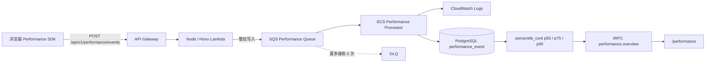

Feature 7 在现有 Web、Node Lambda 和 PostgreSQL 之上增加一条凭证隔离的浏览器
RUM 链路。浏览器只向项目公开 API 发送受限事件；Lambda 是轻量接收入口，ECS
Processor 是唯一清洗边界，PostgreSQL 是 `/performance` 的在线统计数据源。

<Callout title="当前完成状态">
  核心真实链路已经完成云端验收：7 条受控事件完整经过 API、SQS、ECS、
  CloudWatch Logs 和 PostgreSQL，并由生产 `/performance` 回读。后续新增的 SPA
  路由采集和 ECS 0→1→0 自动伸缩增强已完成代码与模板验证，但仍需通过 reviewed
  Change Set 完成单独的云端验收；这不等于核心链路尚未上线。
</Callout>

## 架构

## 为什么称为“性能事件接收入口”

Node/Hono Lambda 只完成接入所必需的工作：

1. 在读取前限制请求体为 64 KiB。
2. 解析 JSON，并使用共享 Zod schema 校验批次。
3. 将整个批次写入一条 SQS 消息。
4. 返回 `202 Accepted`，不在响应或日志中反射事件内容。

它不负责脱敏、route 归一化、统计或数据库写入。所有清洗和持久化均由独立 ECS
Processor 完成，因此架构图采用更直观的“性能事件接收与异步队列”，不再使用容易
产生理解门槛的“薄入口”标题。

## 浏览器 SDK

SDK 动态加载 `web-vitals`，采集 LCP、INP、CLS、FCP、TTFB，并记录 page-view、
resource 和受控 error 事件。满足任一条件便执行 flush：

- 累计 20 条事件；
- 距上次发送 5 秒；
- 页面进入 hidden；
- 调用方显式执行 `flush()`。

浏览器不持有 AWS 凭证，也不直接访问 SQS、CloudWatch 或数据库。事件协议禁止任意
metadata map，避免意外收集敏感字段和高基数数据。

## ECS 清洗与自动伸缩

Processor 使用 20 秒 SQS 长轮询，依次执行契约校验、时间窗校验、route 归一化、
凭证模式脱敏和幂等批量写入。非法契约属于永久错误，记录稳定原因后确认消费；
数据库或 AWS 暂时故障不删除消息，由 visibility timeout 和 DLQ 负责重试。

自动伸缩代码把 Service 限制为 `MinCapacity=0`、`MaxCapacity=1`：

- 有可见消息时，扩容至 1；
- 可见消息与处理中消息持续为空时，缩容至 0；
- scale-in 需要连续空闲并保留 cooldown，避免数据库写入期间停止 Task。

<Callout type="warn" title="自动伸缩增强的部署状态">
  当前生产链路曾通过 reviewed Change Set 短时将 Processor 切到 1 完成真实验收，
  验收后恢复为 0。队列驱动的自动伸缩策略属于后续增强，完成 Change Set、真实
  浏览器首访与 SPA 跳转、自动启动和排空归零验证前，不应写成已云端验收。
</Callout>

## PostgreSQL 与统计页面

`performance_event` 使用 `event_id` UUID 主键和 `ON CONFLICT DO NOTHING` 保证
幂等。第一版保留 7 天清洗样本，并使用 PostgreSQL `percentile_cont` 直接计算真实
p50、p75 和 p95；多个批次的百分位数不能通过平均得到总体百分位数。

`performance.overview` 单次返回五项 Web Vitals、错误率、页面访问量、匿名 session、
处理延迟、趋势、route 对比、慢请求和错误分组。页面筛选使用 React Query
`keepPreviousData` 保留上一份成功结果，后台更新时不会整页闪白。

CloudWatch Logs 只保存清洗过程和稳定诊断字段，不是页面加载时的在线查询数据源。

## 已完成的真实验收

- 生产 Origin 的 CORS OPTIONS 返回 `204`，POST 返回 `202 {"accepted":7}`。
- SQS 批次被 Processor 消费，日志记录 `received=7`、`inserted=7`、
  `duplicates=0`。
- 五项 Web Vitals、page-view 和受控 error 均完成清洗并写入 PostgreSQL。
- `/performance` 回读真实 p75、错误数、访问量、处理延迟和 route 对比。
- 新 migration 只创建独立 performance 表与索引；Token 管理和 AI Ops 原有读路径
  冒烟通过。
- 验收结束后 Processor 恢复 `DesiredCount=0`，主队列和 DLQ 均无积压。

完整云端证据、workflow run 和保留项见
`specs/7.performance-observability/verification.md`。

## 进一步阅读

- 需求与边界：`specs/7.performance-observability/requirements.md`
- 技术设计：`specs/7.performance-observability/design.md`
- 任务与部署状态：`specs/7.performance-observability/tasks.md`
- 真实验收记录：`specs/7.performance-observability/verification.md`
- 云端日常操作与故障处理：`infra/RUNBOOK.md`
- 各阶段架构图：[架构图总览](/docs/deployment/architecture-gallery)
