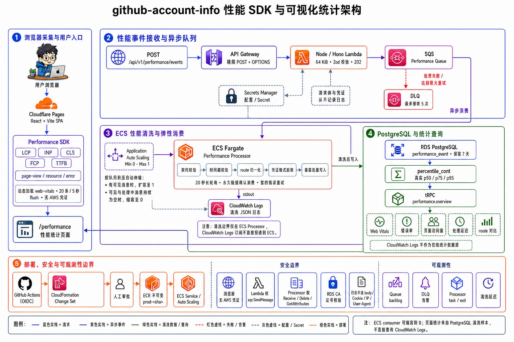
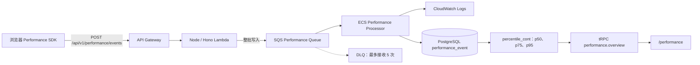

Feature 7 在现有 Web、Node Lambda 和 PostgreSQL 之上增加一条凭证隔离的浏览器
Performance SDK 链路。它属于 RUM（Real User Monitoring，真实用户监控）：浏览器
只向项目公开 API 发送受限事件，Lambda 负责快速接收和入队，ECS Processor 负责
清洗，PostgreSQL 保存 7 天样本并为 `/performance` 提供在线统计。

<Callout title="当前完成状态">
  核心真实链路已经完成云端验收：7 条受控事件完整经过 API、SQS、ECS、
  CloudWatch Logs 和 PostgreSQL，并由生产 `/performance` 回读。当前分支进一步
  增加 SPA 路由采集、常驻一个 Processor 和页面 10 秒后台刷新，以实现约
  10–20 秒可见；这部分仍需通过 reviewed Change Set 和生产页面发布完成验收。
</Callout>

## 先看结论

这一套功能不是单独做了一个漂亮的仪表盘，而是完成了从浏览器采集到统计展示的完整
闭环：

1. 浏览器 Performance SDK 采集五项 Web Vitals、访问、请求和错误。
2. Hono 接口验证批次并写入 SQS，不在用户请求中同步操作数据库。
3. ECS Processor 对事件二次校验、脱敏、规范化并幂等写入 PostgreSQL。
4. 统计 API 基于原始样本计算真实 p50、p75 和 p95。
5. `/performance` 展示五项核心指标、访问量、错误率、趋势、路由对比和慢请求。
6. 切换时间、环境、版本或路由时保留旧数据并后台更新，不再整页白屏。
7. 页面可见时每 10 秒回读一次；结合 SDK 约 5 秒 flush 和常驻 Processor，新数据
   的正常目标是约 10–20 秒出现在页面。

这条链路把采集、接收、清洗、存储和查询职责分开。监控功能即使暂时失败，也不应该
阻塞用户正常使用 GitHub 账号管理、个人主页或 AI Ops 功能。

## 架构





### 各层职责

| 层级 | 负责什么 | 明确不负责什么 |
| --- | --- | --- |
| 浏览器 Performance SDK | 采集、脱敏、缓冲、批量发送 | 不持有 AWS 凭证，不直接访问数据库 |
| API Gateway + Hono Lambda | 限制体积、校验协议、写入 SQS | 不清洗、不聚合、不同步写 PostgreSQL |
| SQS + DLQ | 削峰、解耦、暂时失败重试 | 不代表消息已经成功入库 |
| ECS Processor | 二次校验、清洗、路由归一化、幂等入库 | 不提供页面查询接口 |
| PostgreSQL | 保存清洗样本、计算真实百分位数 | 不接收未经清洗的浏览器输入 |
| tRPC + `/performance` | 参数化查询、评级和可视化 | 不在浏览器重新计算百分位数 |

## 完整实现过程

这一节按实际开发顺序记录功能如何从需求落到代码和云端。每一步都先确定边界，
再实现和验证；不是先创建 AWS 资源，最后再想数据如何流动。

### 第 1 步：把需求拆成可验证的链路

原始要求是“开发性能 SDK，把日志写到 AWS 日志服务器，用 ECS 清洗，再开发页面
可视化统计”。实现前先解决三个容易误解的点：

1. “日志服务器”不是让浏览器持有 AWS 凭证直写 CloudWatch。
2. CloudWatch Logs subscription 不能直接把日志推给 ECS，它的原生目标是 Lambda、
   Kinesis、Firehose、OpenSearch 等。
3. ECS Fargate 是运行清洗程序的计算平台，不是数据库。

因此最终采用：

```text
Browser SDK → Hono HTTP 入口 → SQS → ECS Processor
                                  ├─ CloudWatch Logs
                                  └─ PostgreSQL → tRPC → 页面
```

浏览器只认识项目 API；SQS 隔离请求流量和清洗速度；ECS 是唯一清洗边界；
PostgreSQL 保存可计算真实百分位数的样本。

### 第 2 步：先定义共享事件协议

创建 `packages/performance-schema`，用 Zod 固定浏览器、队列、Processor 和统计 API
之间的边界。事件公共字段包括：

- `schemaVersion`：协议版本；
- `eventId`：全链路幂等 UUID；
- `occurredAt`：浏览器产生时间；
- `appId`、`environment`、`release`：应用和发布维度；
- `sessionId`：匿名会话维度；
- `route`：已经删除 query/fragment 的页面路径；
- `type`、`name`、`value`、`unit`：事件类别和指标数据。

协议明确限制批次大小、字符串长度、指标名称和单位。CLS 必须使用无单位 `score`，
其他 Web Vitals 使用 `ms`。事件不允许携带任意 metadata map，避免 SDK 被当成上传
用户信息、Token 或高基数字段的通道。

浏览器 SDK 对共享 Schema 只做 `import type`。协议常量在 SDK 中保留校准过的字面量，
避免 Vite 把 Zod 打入性能采集 chunk；运行时严格校验留在 Hono 和 ECS 两个服务端
边界。

### 第 3 步：实现浏览器 Performance SDK

创建 `packages/performance-sdk`，核心 API 为：

```text
createPerformanceMonitor()
  ├─ start()
  ├─ stop()
  ├─ flush()
  ├─ track()
  └─ trackPageView()
```

实现顺序：

1. 用 `web-vitals` observer 采集 LCP、INP、CLS、FCP、TTFB；
2. 监听 Error 和未处理 Promise rejection；
3. 用 PerformanceObserver 记录 fetch/XHR 资源耗时；
4. 实现 page-view 和受限 custom event；
5. 增加 URL 归一化、错误文本脱敏和长度限制；
6. 增加 20 条批量、5 秒 flush、100 条队列上限和一次失败回填；
7. hidden 状态使用 `sendBeacon`，普通发送使用 keepalive fetch；
8. 排除 SDK 自己的上传请求，避免递归采集。

采集失败全部静默降级。监控数据可以在明确上限内丢失，但不能抛出异常破坏宿主页面，
也不能在弱网下无限重试。

### 第 4 步：把 SDK 接入 Web 和 SPA Router

Web 接入没有直接在入口静态 import SDK，而是在 React 首屏当前任务结束后，通过
`setTimeout(..., 0)` 动态加载监控 chunk。这里不使用 `requestIdleCallback`：
它的 timeout 不是严格的执行期限，后台标签页或持续繁忙页面可能长期等不到 idle
回调，导致页面正常但 SDK 没有启动。动态 import 仍会生成独立 chunk，因此不会把
监控依赖重新塞回首屏主包。配置来自：

```text
VITE_PERFORMANCE_ENABLED
VITE_APP_ENVIRONMENT
VITE_APP_RELEASE
VITE_SERVER_URL
```

第一版只在 monitor `start()` 时记录首访，后来线上诊断发现 TanStack Router 的站内
跳转不会重新执行应用入口，因此访问 `/` 后再进入 `/performance` 不会增加访问量。

最终接入方式是：

1. SDK 加载前立即固定初始 URL；
2. 关闭 SDK 内置的自动首访，加载完成后由 Web 显式补报一次；
3. 订阅 Router `onResolved`；
4. 仅当存在 `fromLocation` 且 `pathChanged=true` 时记录 SPA 访问；
5. SDK 尚未就绪的跳转暂存到最多 100 条的内存队列；
6. 首访、暂存路由重放和真实 SPA 跳转在入队后立即触发一次有界 `flush()`；
7. query/hash 变化不计入新的页面访问。

这样首访不会重复，SPA path 不会漏报，慢速设备也不会因为 SDK 延迟加载丢掉最近
跳转。页面访问不等待可能被浏览器节流的 5 秒 interval；Web Vitals、错误和资源耗时
仍按 SDK 的批量策略发送。

生产验收时还发现一个容易误判的问题：Cloudflare Pages 可以成功构建出 SDK chunk，
但这不等于浏览器已经执行了采集。验收必须继续观察事件入口、SQS 和 Processor 日志。
SDK 使用 dynamic import 保持独立分包，但直接发起 import，不再套
`requestIdleCallback` 或 `setTimeout`；后两者都可能在后台或受控浏览器中被延迟。
如果线上页面能读取统计、SDK chunk 也返回 200，但新访问没有进入 SQS，应先检查
SDK 启动与 flush 调度，而不是重复修改 AWS 清洗链路。

### 第 5 步：新增精确 Hono 接收路由

Node API 已有 `GET /api/v1/{proxy+}` 指向 Go VPC Link。如果把性能 POST 放进 wildcard，
浏览器事件会被错误转发给 Go 服务。因此 Server SAM 模板单独声明：

```text
POST /api/v1/performance/events
OPTIONS /api/v1/performance/events
```

Hono 路由按顺序执行：

1. 在读取前限制请求体为 64 KiB；
2. JSON 解析；
3. 共享 Zod Schema 校验；
4. 将整个 batch 作为一条消息写入指定 SQS；
5. 返回 `202 Accepted`。

入口不记录原始 body，也不把事件内容反射给调用方。Node Lambda Role 只获得目标
Queue 的 `sqs:SendMessage`。

### 第 6 步：实现独立 ECS Processor

创建 `apps/performance-processor`，与 Node API 和 Go API 分开构建。Processor 使用
20 秒 SQS 长轮询，每次最多读取 10 个 batch，并执行：

- 二次协议校验；
- 7 天过去时间窗和 5 分钟未来时间窗校验；
- 动态路由归一化；
- Token、Authorization、密码、Secret、API Key 二次脱敏；
- `processingLagMs` 计算；
- PostgreSQL 事务写入；
- JSON stdout 写入 CloudWatch Logs。

错误分类决定 SQS 语义：

- JSON、Schema、时间窗非法属于永久错误，记录稳定原因后删除消息；
- 数据库、AWS 或未知运行时故障属于暂时错误，不删除消息；
- 暂时错误由 visibility timeout 重试，耗尽次数后进入 DLQ。

容器生产连接 RDS 时加载区域 CA bundle 并启用证书校验。只有本地 SSM 隧道才允许
使用针对 `127.0.0.1` hostname 不匹配的兼容参数，生产禁止
`rejectUnauthorized: false`。

### 第 7 步：设计独立表和生产迁移

新增 `performance_event` 表，而不是修改账号、Token 或 AI Ops 表。表使用
`event_id` UUID 主键，并为以下查询建立索引：

- 应用 + 环境 + 时间；
- 应用 + 指标 + 时间；
- 应用 + 路由 + 时间。

Migration 只包含 additive DDL：创建一张独立表和三个索引。因为 RDS 位于私有子网，
生产迁移不能从 GitHub-hosted runner 直连，也不能用本机 root 开 SSM 隧道。

最终复用 Processor 镜像和 Task Definition，以
`PERFORMANCE_PROCESSOR_MODE=migrate` 在私有网络运行一次性 Fargate Task。Workflow
等待该 Task 停止并检查精确容器退出码，Secret 始终由 ECS 注入。

迁移成功后又单独验证 Token 管理、账号读取和 AI Ops 原有路径，避免把“migration
退出码为 0”误写成“原功能一定不受影响”。

### 第 8 步：实现真实百分位数统计 API

新增 `performance.overview`，输入为时间范围、环境、版本和路由。服务端并行执行
七组参数化 SQL，使用 PostgreSQL `percentile_cont` 直接计算 p50、p75 和 p95。

没有把每批 p75 预聚合后再求平均，因为百分位数不可组合。第一版数据量低，保存 7 天
清洗样本可以得到正确结果，也便于回看 SDK 真实输入。

统计 API 始终按协议顺序返回五项指标；没有样本时返回 `null` 和 count 0，而不是
删除该项。React 页面因此能保持稳定布局。

### 第 9 步：实现并迭代可视化页面

`/performance` 从基础统计页逐步迭代成当前仪表盘：

1. 第一版先打通五项卡片、错误率、访问量和趋势；
2. 增加环境、版本、路由和时间范围筛选；
3. 增加 route 五项 p75 对比、慢请求排行和错误分布；
4. 单个时间桶改成居中单点和基线，不伪造连续趋势；
5. 路由表、慢请求和错误卡片移除固定空白高度；
6. 统一项目蓝色主题、状态色、图标和响应式布局；
7. 使用 `keepPreviousData` 让筛选后台更新，不再整页白屏；
8. 后台刷新失败时保留上一份成功数据并显示局部提示。

前端类型由 `inferRouterOutputs<AppRouter>` 推导，不重复手写 API interface。

### 第 10 步：用 IaC 和 OIDC 部署

`infra/performance.yaml` 定义 Queue、DLQ、ECR、Task Definition、ECS Service、
Log Group、IAM、Alarm 和 0 到 1 自动伸缩。部署权限由独立
`performance-deployer-policy.yaml` 补充到现有 OIDC Role。

首次创建必须先让 Runtime Stack 以 `DesiredCount=0` 创建 ECR，再推送不可变
`prod-<git-sha>` 镜像。不能使用 `latest`，也不能在镜像不存在时直接启动 Service。

所有 AWS 写操作通过 `Performance Change Set` workflow 完成。创建和执行 Change
Set 是两个独立操作，执行前检查 Replacement、镜像标签、DesiredCount 和资源范围。

### 第 11 步：分层完成验证

完成状态分成四层：

| 层级 | 证明什么 |
| --- | --- |
| 代码侧 MVP | Schema、SDK、Processor、API 和页面已经实现 |
| 部署准备 | 测试、构建、SAM、CloudFormation 和 workflow 静态边界通过 |
| 云端部署 | Stack、镜像、Task、Queue、Lambda 参数和数据库迁移成功 |
| 真实链路验收 | 事件真的经过 API、SQS、ECS、Logs、PostgreSQL 并由页面回读 |

真实验收使用 7 条受控事件，确认 POST 返回 accepted 7，Processor 日志记录
received 7、inserted 7、duplicates 0，五项 Web Vitals、page-view 和 error 均从
PostgreSQL 被 `/performance` 回读。验收后 Processor 恢复为 0，主队列和 DLQ
排空。

### 实现过程中最重要的教训

| 问题 | 最终处理 |
| --- | --- |
| CloudWatch Logs 不能直接推 ECS | 使用 HTTP → SQS → ECS |
| 浏览器不能持有 AWS 凭证 | 只调用匿名、限 Schema 的项目 API |
| 首次创建时 ECR 还没有镜像 | Stack 先以 DesiredCount 0 创建，再推不可变镜像 |
| p75 不能通过平均组合 | 保留清洗样本，用 `percentile_cont` 计算 |
| 毒消息会反复污染 DLQ | 永久错误确认消费，暂时错误才重试 |
| 私有 RDS 无法由 hosted runner 迁移 | 运行一次性 Fargate migration Task |
| 单时间桶图表大片空白 | 居中单点并明确样本不足 |
| SPA 跳转不重新运行入口 | 订阅 Router resolved path change |
| DesiredCount 0 不会自动消费 | 增加 Queue 驱动的 Min 0 / Max 1 自动伸缩 |
| 筛选改变导致整页白屏 | 保留上一份数据并后台刷新 |

## 浏览器 Performance SDK

核心实现位于 `packages/performance-sdk`，Web 应用通过
`apps/web/src/utils/performance-monitor.ts` 接入。SDK 在 React 首屏挂载后等待浏览器
空闲，再动态加载独立监控 chunk 和 `web-vitals`，避免把监控代码放进首屏关键路径。

### 采集内容

| 事件类型 | 采集内容 | 页面用途 |
| --- | --- | --- |
| `web-vital` | LCP、INP、CLS、FCP、TTFB | 五项指标卡片、趋势、路由对比 |
| `page-view` | 首次访问和真实 SPA path 切换 | 页面访问量、匿名 session |
| `resource` | 浏览器 fetch/XHR 耗时 | 慢请求 p95 排行 |
| `error` | Error 和未处理 Promise rejection | 错误率、错误类型分布 |
| `custom` | 受限名称和非负数值 | 后续业务性能扩展 |

### 五项指标怎么理解

| 指标 | 中文含义 | 单位 | 当前良好阈值 |
| --- | --- | --- | --- |
| LCP | 最大内容绘制，主要内容多久出现 | `ms` | ≤ 2500 ms |
| INP | 用户交互后的响应速度 | `ms` | ≤ 200 ms |
| CLS | 页面元素意外移动的程度 | 无单位 `score` | ≤ 0.1 |
| FCP | 首个内容多久绘制出来 | `ms` | ≤ 1800 ms |
| TTFB | 请求首字节响应时间 | `ms` | ≤ 800 ms |

CLS 是一个布局偏移评分，不是时间，因此 `0.05` 不能写成 `0.05 ms`。页面会保留
三位小数；其他四项根据数值显示为毫秒或秒。

### 页面访问如何统计

SDK 不只在应用启动时统计一次访问：

- 首次打开页面时显式记录一个 `page-view`；
- TanStack Router 完成真实 path change 后记录新的 `page-view`；
- 只修改 query 或 hash 不增加访问量；
- SDK 动态 chunk 尚未加载完成时，最多暂存 100 次路由切换，加载完成后按顺序补报；
- `/u/alice`、`/u/bob` 会归一化为 `/u/:username`，数字、UUID 和长哈希会归一化为
  `:id`，避免路由维度无限增长。

页面中的“页面访问量”来自 `page-view` 事件数，不使用 Web Vital 样本数代替。
“匿名会话数”来自随机 `sessionId`，它不是登录身份，也不能用于识别具体用户。

### 缓冲、发送与失败策略

满足任一条件便执行 flush：

- 累计 20 条事件；
- 距上次发送 5 秒；
- 页面进入 hidden；
- 调用方显式执行 `flush()`。

内存队列最多保留 100 条。发送失败的批次只回填一次，持续失败时允许有界丢弃，
不能让监控数据占满内存或拖慢业务页面。页面隐藏时优先使用 `sendBeacon`，正常前台
使用 `fetch + keepalive`，并显式设置 `credentials: "omit"`。

SDK 会排除自己的 `/api/v1/performance/events` 上传请求，避免形成“监控上传请求又
产生新的监控事件”的递归噪声。

### 隐私和脱敏

浏览器侧只保留 URL pathname，不保存 query、fragment、Cookie 或 Token。错误消息和
资源地址会限制长度并替换常见凭证形态。Processor 仍会执行第二次脱敏，因为服务端
不能信任浏览器一定运行了最新版 SDK。

## 性能事件接收入口

Node/Hono Lambda 只完成接入所必需的工作：

1. 在读取前限制请求体为 64 KiB。
2. 解析 JSON，并使用共享 Zod schema 校验批次。
3. 将整个批次写入一条 SQS 消息。
4. 返回 `202 Accepted`，不在响应或日志中反射事件内容。

它不负责脱敏、route 归一化、统计或数据库写入。所有清洗和持久化均由独立 ECS
Processor 完成，因此架构图采用更直观的“性能事件接收与异步队列”，不再使用容易
产生理解门槛的“薄入口”标题。

接口路径固定为：

```text
POST /api/v1/performance/events
```

返回码含义：

- `202`：批次已经被 SQS 接受，尚不代表已经写入 PostgreSQL；
- `400`：JSON 或事件协议非法；
- `413`：请求体超过 64 KiB；
- `503`：队列未配置或暂时无法入队。

日志只记录稳定错误码和错误类型，不打印原始请求体，防止 URL、错误消息或凭证进入
CloudWatch Logs。

## ECS 清洗与运行容量

Processor 使用 20 秒 SQS 长轮询，依次执行契约校验、时间窗校验、route 归一化、
凭证模式脱敏和幂等批量写入。非法契约属于永久错误，记录稳定原因后确认消费；
数据库或 AWS 暂时故障不删除消息，由 visibility timeout 和 DLQ 负责重试。

当前准实时模式把 Service 限制为 `MinCapacity=1`、`MaxCapacity=1`：

- 一个 Processor 常驻并使用 SQS 长轮询，消息到达后无需等待 CloudWatch 分钟级
  指标和 Fargate 冷启动；
- 页面标签页可见时，每 10 秒后台查询 PostgreSQL；
- 刷新期间继续展示上一份成功数据，不会整页白屏。

模板仍保留低成本模式。通过 reviewed Change Set 传 `DesiredCount=0` 时，
`MinCapacity` 同步变为 0：有可见消息才扩容到 1，队列连续排空后缩回 0。

<Callout type="warn" title="准实时改动的部署状态">
  2026-07-27 的线上基线仍是 `DesiredCount=0`。当前分支的常驻 Processor 与
  10 秒页面刷新完成本地实现后，仍需合并到 `master`、执行 reviewed Change Set
  并发布 Web；完成真实浏览器验收前，不能写成已上线。
</Callout>

### 清洗步骤

一条 SQS 消息对应一个已经通过入口校验的事件批次。Processor 仍会重新执行：

1. JSON 和共享 Schema 校验；
2. 事件时间不得早于 7 天，也不得晚于服务器时间 5 分钟以上；
3. 删除 URL query/fragment 并归一化动态路由；
4. 替换 Token、Authorization、密码、Secret 和 API Key 等凭证形态；
5. 计算 `processingLagMs = receivedAt - occurredAt`；
6. 在一个 PostgreSQL 事务中写入完整批次；
7. 使用 `event_id` 主键和 `ON CONFLICT DO NOTHING` 处理重复投递。

永久非法数据会记录稳定原因并确认消费，避免毒消息无意义地重试五次。数据库连接或
AWS 暂时失败则不删除消息，等待 visibility timeout 后重新消费，最终仍失败才进入
DLQ。

### ECS Fargate 在这里做什么

Fargate 运行的是清洗消费者，不负责存数据。真正的数据存储是 PostgreSQL；SQS 只
暂存待处理消息。低流量时 Processor 可以缩容到 0，队列出现消息后再启动到 1，
处理完并持续空闲后回到 0。

因此它的取舍是：

- 优点：浏览器请求很快返回，清洗故障不会直接拖垮页面；
- 代价：从事件产生到页面可见存在队列等待和 Fargate 冷启动延迟；
- 成本控制：最多一个 Task，空闲时为 0，避免长期支付常驻计算费用。

## AWS 部署

性能链路不是在本机运行一条 AWS CLI 命令直接部署。所有 AWS 写操作统一通过
GitHub Actions OIDC 获取 `github-actions-deployer` 的短期凭证，并采用
“创建 Change Set → 人工审查 → 执行 Change Set”的两阶段流程。

<Callout type="warn" title="部署身份边界">
  当前部署 Role 的信任策略只允许可信的 `master` 分支上下文。Feature 分支用于开发、
  测试和创建 PR；合并到 `master` 后再运行正式部署。禁止使用本机 root 凭证部署，
  也禁止把长期 AWS Access Key 写入 GitHub Secrets。
</Callout>

### AWS 中创建了哪些资源

`infra/performance.yaml` 管理独立 Stack `github-account-info-performance`：

| 资源 | 固定用途 |
| --- | --- |
| SQS Performance Queue | 接收 Lambda 写入的性能事件批次 |
| SQS DLQ | 保存耗尽重试的暂时性失败消息 |
| ECR Repository | 保存不可变 `prod-<git-sha>` Processor 镜像 |
| ECS Task Definition | 定义 Processor 镜像、CPU/内存、Secret 和日志配置 |
| ECS Fargate Service | 在现有私有网络中运行清洗消费者 |
| ECS Execution Role | 拉取 ECR 镜像、读取 Secret、写入 CloudWatch Logs |
| ECS Task Role | 仅允许消费指定 Performance Queue |
| CloudWatch Log Group | 保存 Processor 结构化清洗和错误日志 |
| Application Auto Scaling | 将 Processor 容量限制在 0 到 1 |
| Scale-out / Scale-in Alarm | 队列有消息时启动，排空并持续空闲后停止 |
| Queue Age / DLQ Alarm | 发现清洗延迟和耗尽重试的问题 |

部署权限由另一个 Stack `github-account-info-performance-deployer-policy` 管理，
模板为 `infra/performance-deployer-policy.yaml`。它只给现有 OIDC Role 增加当前
功能所需的 SQS、ECR、ECS、Auto Scaling、Logs、Alarm 和一次性迁移权限，不授予
`sqs:*`、`ecs:*` 或管理员权限。

### 三条发布链路

完整上线由三部分组成：

```text
Performance Change Set workflow
  └─ AWS SQS / ECR / ECS / IAM / CloudWatch / migration

Deploy Lambda workflow
  └─ Hono 接收路由、SQS SendMessage 权限、performance.overview

Cloudflare Pages Git 集成
  └─ 浏览器 Performance SDK、SPA 路由采集、/performance 页面
```

只部署其中一部分会出现不完整状态：

- 只部署 Web：浏览器可能发请求，但后端没有接入 Queue；
- 只部署 Performance Stack：有 Queue 和 Processor，但 Lambda 还不能接收事件；
- 只部署 Lambda：入口可能返回 503，因为 Performance Stack Outputs 不存在；
- 未执行迁移：Processor 连接数据库后找不到 `performance_event` 表；
- Web 没有生产环境变量：SDK 不启动，后台资源正常但没有浏览器事件。

### Performance Change Set 工作流

GitHub Actions 中的 `Performance Change Set` 对应
`.github/workflows/performance-change-set.yml`，提供六种操作：

| operation | 作用 | 关键输入 |
| --- | --- | --- |
| `create-policy-change-set` | 创建最小权限 Policy Change Set | 无 |
| `execute-policy-change-set` | 执行已经人工审查的 Policy Change Set | `change_set_name` |
| `create-runtime-change-set` | 创建运行时资源 Change Set | `image_tag`、`desired_count` |
| `execute-runtime-change-set` | 执行已经人工审查的运行时 Change Set | `change_set_name` |
| `push-image` | 测试、构建并推送不可变 Processor 镜像 | `image_tag` |
| `migrate-database` | 在私有子网运行一次性 Fargate migration Task | 无 |

`image_tag` 必须匹配 `prod-<7到40位小写Git SHA>`。不允许使用 `latest`，否则无法
确认当前 Task 实际运行哪份代码，也无法可靠回滚。

### 首次创建 AWS 资源

首次部署存在一个顺序约束：ECR Repository 和 ECS Service 在同一个 Stack 中，而
镜像只有 Repository 创建后才能推送。因此第一次必须按下面顺序执行：

1. 合并经过测试的代码到 `master`。
2. 运行 `create-policy-change-set`。
3. 在 CloudFormation 中检查只创建预期的最小权限 Managed Policy，没有无关资源。
4. 记录 workflow summary 里的 Change Set 名称，运行
   `execute-policy-change-set`。
5. 运行 `create-runtime-change-set`，指定不可变 `image_tag`，并保持
   `desired_count=0`。
6. 审查首次 Runtime Change Set：Queue、DLQ、ECR、Task Definition、Service、
   Roles、Log Group、Alarm 和 Auto Scaling 必须属于 Performance Stack。
7. 运行 `execute-runtime-change-set`。此时 Service 为 0，即使镜像尚不存在也不会
   启动失败 Task。
8. 运行 `push-image`，使用与 Runtime Change Set 完全相同的 `image_tag`。
9. 运行 `migrate-database`，等待一次性 Task 停止且容器退出码为 0。
10. 手动触发或等待 `Deploy Lambda`，让 Node Stack 读取 Performance Queue Outputs。
11. 确认 Cloudflare Pages production 已构建包含 SDK 的最新 `master`。
12. 发送受控事件，验收 SQS、ECS、Logs、PostgreSQL 和 `/performance`。

第一次 Runtime Change Set 如果使用 `desired_count=1`，workflow 会直接拒绝，防止
ECR 尚无镜像时 Service 反复启动失败。

### 已有 Stack 的日常更新

当前项目已经存在 Performance Stack，日常发布 Processor 或 IaC 更新时使用：

1. 确认 PR 已合并到 `master`，记下完整 Git SHA。
2. 若 `performance-deployer-policy.yaml` 有变化，先创建、审查并执行 Policy
   Change Set；权限模板未变化时不需要重复更新。
3. 运行 `push-image`，镜像标签使用 `prod-<完整Git SHA>`。
4. 运行 `create-runtime-change-set`，使用相同镜像标签和
   `desired_count=1`。
5. 审查 Changes、Parameters 和 Replacement：
   - 镜像标签必须是刚推送的不可变标签；
   - 准实时模式的 `DesiredCount` 和 `MinCapacity` 都应为 1；
   - 不应替换 Queue、DLQ 或 ECR；
   - 不应出现 Performance Stack 之外的资源；
   - 涉及数据库、Queue 或 Service 替换时先停止，不执行。
6. 使用 summary 中的精确名称运行 `execute-runtime-change-set`。
7. 有新 migration 时运行 `migrate-database`；没有 migration 不需要为了形式重复跑。
8. Node/API/Schema 变化由 `Deploy Lambda` workflow 构建并灰度发布 Lambda。
9. Web/SDK/页面变化由 Cloudflare Pages 根据 `master` 自动发布。
10. 完成生产只读检查和真实事件验收。

`create-*` 和 `execute-*` 必须是两个独立操作。创建成功不代表允许立即执行，必须先
阅读 Change Set 中的 Action、Logical ID、Resource Type 和 Replacement。

### 数据库迁移为什么通过 ECS Task

RDS 位于私有网络，GitHub-hosted runner 不应直接连接数据库。`migrate-database`
会读取当前 Performance Service 的 Task Definition 和网络配置，在相同 private
subnet 中运行一次 Fargate Task，并覆盖：

```text
PERFORMANCE_PROCESSOR_MODE=migrate
```

这个 Task 使用 ECS 注入的数据库 Secret，执行镜像内的 Drizzle migration 后退出。
Workflow 只等待该精确 Task，要求容器退出码为 0；失败或取消时只停止本次迁移 Task。

迁移安全要求：

- migration 文件必须已经包含在不可变镜像中；
- 先审查 migration 只有预期的 additive DDL；
- `DATABASE_URL` 不能展开到 workflow 输出或日志；
- 不能用本机 root 开 SSM 隧道代替生产迁移；
- 迁移成功后仍要单独冒烟原 Token、账号管理和 AI Ops 读路径。

### Node Lambda 如何接入 Queue

`Deploy Lambda` workflow 在 `master` 的 Server、API、DB、Env 或 Performance
Schema 变化时自动运行，也可以手动触发。`apps/server/deploy-canary.sh` 会：

1. 检查 `github-account-info-performance` Stack 是否存在；
2. 从 Outputs 读取 `PerformanceQueueUrl` 和 `PerformanceQueueArn`；
3. 要求 URL 和 ARN 同时完整，半套配置立即失败；
4. 将两项作为 SAM 参数注入 Node Stack；
5. 只给 Lambda Role 增加对该 Queue 的 `sqs:SendMessage`；
6. 发布不可变 Lambda Version，通过 `live` alias 灰度后晋级。

这样 Queue URL/ARN 不需要在 GitHub Secrets 或 Variables 中重复维护，也不会因为
手工复制错误而把事件发到其他队列。

### Web 与 Cloudflare Pages

前端不部署到 AWS，而是继续由 Cloudflare Pages Git 集成发布。Production 构建至少
需要：

```bash
VITE_SERVER_URL=<API Gateway production URL>
VITE_PERFORMANCE_ENABLED=true
VITE_APP_ENVIRONMENT=production
VITE_APP_RELEASE=<当前发布版本或Git短SHA>
```

`VITE_APP_RELEASE` 会编译进静态 bundle，因此每次生产发布应更新为当前版本。发布后
在浏览器 Network 中确认请求目标是 production API，而不是 localhost 或 Preview。

### 部署后验收

先做只读资源检查，再发送受控事件：

```bash
aws cloudformation describe-stacks \
  --region us-east-2 \
  --stack-name github-account-info-performance

aws ecs describe-services \
  --region us-east-2 \
  --cluster github-account-info-go \
  --services github-account-info-performance \
  --query 'services[0].{Desired:desiredCount,Running:runningCount,Pending:pendingCount,TaskDefinition:taskDefinition,Events:events[0:5]}'

aws application-autoscaling describe-scalable-targets \
  --region us-east-2 \
  --service-namespace ecs \
  --resource-ids service/github-account-info-go/github-account-info-performance \
  --scalable-dimension ecs:service:DesiredCount
```

真实链路验收顺序：

1. Production Origin 的 OPTIONS 返回预期 CORS 响应；
2. POST 返回 `202` 且 accepted 数量正确；
3. SQS 可见消息增加；
4. 自动伸缩部署后，ECS 从 0 启动到 1；
5. Processor 日志出现 received、inserted 和 duplicates，且不包含原始凭证；
6. PostgreSQL 中出现新的清洗样本；
7. `/performance` 刷新后出现对应环境、版本、路由和指标；
8. Queue 可见与处理中消息均归零；
9. 连续空闲后 ECS 从 1 恢复到 0；
10. DLQ 保持为空。

如果自动伸缩增强还没有执行 reviewed Change Set，第 4 和第 9 步不会自动发生。此时
`202` 事件会留在 SQS，不能据此宣称完整链路已经验收。

### 回滚与禁止操作

Processor 回滚使用旧的不可变 `prod-<git-sha>` 创建新的 Runtime Change Set，审查后
执行；不要覆盖旧 ECR tag。Web 回滚使用 Cloudflare Pages 的已知良好 deployment，
Node Lambda 继续使用项目既有的 alias 灰度和回滚流程。

禁止：

- 直接执行 `aws ecs update-service`，这会造成 CloudFormation 和 Auto Scaling drift；
- 用 mutable `latest` 重新标记镜像；
- 未审查 Change Set 就执行；
- 用本机 root 凭证更新 Stack 或运行 migration；
- 为了排障把数据库 Secret、事件原文或 AWS 凭证打印到日志；
- 故障尚未修复时 redrive DLQ；
- 为了清理本功能而删除共享 RDS、ECS Cluster 或 Node API Stack。

### AWS 成本边界

当前准实时设计的主要成本来源：

| 服务 | 当前成本特征 |
| --- | --- |
| ECS Fargate | 准实时模式常驻一个 0.25 vCPU / 0.5 GiB Processor，按运行时长计费 |
| SQS + DLQ | 按请求量计费，低流量通常很小 |
| ECR | 按镜像存储量计费，生命周期策略负责清理旧镜像 |
| CloudWatch Logs | 按写入和保留量计费，日志设置固定保留期 |
| CloudWatch Alarm | 按 Alarm 数量计费 |
| PostgreSQL | 复用现有 RDS，不为 Performance 单独创建数据库实例 |
| Lambda / API Gateway | 复用现有 Node 接入层，按请求量增加少量调用成本 |

这里明确用一个常驻 Processor 的费用换取十几秒内可见。若暂时不需要准实时体验，
可以通过 reviewed Change Set 把 `DesiredCount` 改为 0；`MinCapacity` 会同步为
0，恢复队列驱动的 0→1→0，代价是重新出现分钟级冷启动延迟。

## PostgreSQL 与统计页面

`performance_event` 使用 `event_id` UUID 主键和 `ON CONFLICT DO NOTHING` 保证
幂等。第一版保留 7 天清洗样本，并使用 PostgreSQL `percentile_cont` 直接计算真实
p50、p75 和 p95；多个批次的百分位数不能通过平均得到总体百分位数。

`performance.overview` 单次返回五项 Web Vitals、错误率、页面访问量、匿名 session、
处理延迟、趋势、route 对比、慢请求和错误分组。页面筛选使用 React Query
`keepPreviousData` 保留上一份成功结果，后台更新时不会整页闪白；标签页可见时
每 10 秒自动查询，进入后台后暂停轮询，避免无效请求。

CloudWatch Logs 只保存清洗过程和稳定诊断字段，不是页面加载时的在线查询数据源。

### 为什么保留原始清洗样本

百分位数不能组合。例如两个批次各自的 p75 取平均，不等于全部用户样本的真实 p75。
当前数据量较低，因此保留 7 天清洗样本并直接执行：

```sql
percentile_cont(0.50)
percentile_cont(0.75)
percentile_cont(0.95)
```

这样既能得到正确结果，也方便回查 SDK 是否真的发送了预期数据。规模明显增长后再
考虑 histogram、可合并 sketch 或 S3 归档，而不是提前增加复杂度。

### 统计 API 返回什么

`performance.overview` 接受：

- 时间范围：最近 1 小时、24 小时或 7 天；
- 运行环境；
- 发布版本；
- 页面路由。

服务端并行执行七组参数化查询，返回：

- 固定五项 Web Vitals 的 p50、p75、p95、样本数和评级；
- 页面访问量、匿名会话数、错误数和错误率；
- 浏览器产生到 ECS 清洗完成的处理延迟 p75；
- 按时间桶的五项 p75 趋势；
- 按路由的访问量和五项 p75；
- fetch/XHR 慢请求 p95；
- 清洗后的错误类型分布；
- 最近 7 天可用的环境、版本和路由筛选项。

即使某个指标没有样本，API 也会按协议顺序返回该指标并使用 `null`，因此页面固定
展示五张卡片，不会因为暂时无数据而改变布局。

## 可视化页面

`/performance` 当前包含：

1. 顶部链路状态、页面访问量和五项健康数量；
2. 时间、环境、版本和路由筛选；
3. LCP、INP、CLS、FCP、TTFB 五张 p75 指标卡；
4. 前端错误率、页面访问量和事件处理延迟摘要；
5. 可切换指标的 p75 趋势；
6. 五项性能健康概览；
7. 按页面路由的访问量和五项 p75 对比；
8. fetch/XHR 慢请求排行；
9. 前端错误类型分布。

### 筛选为什么不会再白屏

筛选条件会改变 React Query key，但页面使用 `keepPreviousData`：

- 第一次进入且没有任何数据时才显示整页骨架；
- 筛选变化后继续显示上一份成功结果；
- 新请求在后台执行，筛选栏显示“正在更新”；
- 请求成功后原位替换数据，不重置页面滚动位置；
- 后台刷新失败时保留旧数据并提示“更新失败，已保留上次数据”。

趋势图只有一个时间桶时会把单点放在中间并显示水平参考线，同时明确提示样本不足。
它不会把单点画在左上角，也不会伪造一条不存在的连续趋势。

## 数据什么时候能在页面看到

从浏览器访问到统计页面可见，要依次满足：

```text
SDK flush
  → POST 返回 202
  → SQS 中出现消息
  → ECS Processor 启动并消费
  → PostgreSQL 写入成功
  → /performance 查询或刷新
```

本地设置：

```bash
VITE_PERFORMANCE_ENABLED=true
VITE_APP_ENVIRONMENT=development
VITE_APP_RELEASE=local
```

三项变量的含义：

- `VITE_PERFORMANCE_ENABLED`：是否创建并启动 SDK；关闭时页面本身仍可正常访问；
- `VITE_APP_ENVIRONMENT`：写入事件的环境标签，用于“运行环境”筛选；
- `VITE_APP_RELEASE`：写入事件的版本标签，用于“发布版本”筛选。

只修改环境和版本标签不会带来肉眼可见的页面样式变化，它们体现在新采集事件和筛选项
中。Vite 环境变量在构建或开发服务启动时读取，修改 `.env` 后需要重新启动 Web。

<Callout type="warn" title="202 不等于已经完成统计">
  `202 Accepted` 只证明浏览器到 SQS 的接收链路成功。准实时模式仍需等待常驻
  Processor 清洗入库，以及页面下一次 10 秒轮询；正常目标是约 10–20 秒，不是
  WebSocket 毫秒级推送。如果线上仍为 `DesiredCount=0`，则不会获得这一时效。
</Callout>

## 代码导读

建议按一条事件的流向阅读：

| 顺序 | 文件 | 阅读重点 |
| --- | --- | --- |
| 1 | `packages/performance-schema/src/index.ts` | 事件、批次、单位、筛选和清洗后契约 |
| 2 | `packages/performance-sdk/src/monitor.ts` | 采样、采集、队列、flush、重试 |
| 3 | `packages/performance-sdk/src/sanitize.ts` | 路由归一化和浏览器侧脱敏 |
| 4 | `apps/web/src/utils/performance-monitor.ts` | 环境开关、空闲加载、首访和暂存路由 |
| 5 | `apps/web/src/main.tsx` | TanStack Router SPA path change 订阅 |
| 6 | `apps/server/src/routes/performance.ts` | Hono 64 KiB 限制、状态码和安全日志 |
| 7 | `packages/api/src/services/performance-ingest.ts` | Schema 校验和 SQS 入队 |
| 8 | `apps/performance-processor/src/clean.ts` | 时间窗、脱敏和规范化 |
| 9 | `apps/performance-processor/src/processor.ts` | 长轮询、永久/暂时错误和删除语义 |
| 10 | `apps/performance-processor/src/repository.ts` | 事务、参数化 SQL 和幂等写入 |
| 11 | `packages/db/src/schema/performance-event.ts` | 样本字段和三组统计索引 |
| 12 | `packages/api/src/services/performance-stats.ts` | 百分位、访问量、趋势和路由聚合 |
| 13 | `apps/web/src/routes/performance.tsx` | 五项卡片、筛选和无白屏刷新 |

## 本地验证方法

不需要手工向数据库造统计结果，可以直接观察真实 SDK 请求：

1. 配置上述三个 Vite 环境变量并重新启动 Web。
2. 打开浏览器开发者工具的 Network。
3. 访问首页，再通过站内导航切换一到两个页面。
4. 等待 5 秒，或切换标签页触发 hidden flush。
5. 查找 `/api/v1/performance/events` 请求。
6. 确认响应为 `202`，请求体中没有 Cookie、Token、query 或 fragment。
7. 确认 `page-view.route` 分别对应首次页面和后续真实 path。
8. Processor 已运行并排空队列后，打开 `/performance` 并点击刷新。
9. 切换时间、环境、版本和路由，确认只出现“正在更新”，页面不白屏。

若请求没有出现，依次检查：

- `VITE_PERFORMANCE_ENABLED` 是否为 `true`；
- 修改 `.env` 后是否重新启动了 Web；
- Network 是否过滤了 Fetch/XHR；
- 是否等到 5 秒 flush，或是否切换过标签页；
- API 地址是否来自正确的 `VITE_SERVER_URL`。

## 已完成的真实验收

- 生产 Origin 的 CORS OPTIONS 返回 `204`，POST 返回 `202 {"accepted":7}`。
- SQS 批次被 Processor 消费，日志记录 `received=7`、`inserted=7`、
  `duplicates=0`。
- 五项 Web Vitals、page-view 和受控 error 均完成清洗并写入 PostgreSQL。
- `/performance` 回读真实 p75、错误数、访问量、处理延迟和 route 对比。
- 新 migration 只创建独立 performance 表与索引；Token 管理和 AI Ops 原有读路径
  冒烟通过。
- 2026-07-27 验收结束后 Processor 恢复 `DesiredCount=0`，主队列和 DLQ 均无
  积压；这是历史基线，不代表当前准实时改动已经部署。

已验证与待验证必须分开：

| 能力 | 当前状态 |
| --- | --- |
| API → SQS → ECS → PostgreSQL → `/performance` 核心链路 | 已完成生产真实验收 |
| 五项 Web Vitals、page-view 和 error 清洗入库 | 已完成生产真实验收 |
| 独立 migration 对原 Token 与 AI Ops 读路径的兼容性 | 已完成冒烟 |
| SPA 路由访问补报 | 代码和本地构建完成，待生产真实浏览器验收 |
| ECS 队列驱动 0→1→0 自动伸缩 | 模板验证完成，待 reviewed Change Set 云端验收 |
| 常驻 Processor + 页面 10 秒轮询 | 本地实现与验证完成，待生产准实时验收 |
| 当前分支新增的知识库和详细代码注释 | 本地完成，尚未随分支发布 |

完整云端证据、workflow run 和保留项见
`specs/7.performance-observability/verification.md`。

## 进一步阅读

- 需求与边界：`specs/7.performance-observability/requirements.md`
- 技术设计：`specs/7.performance-observability/design.md`
- 任务与部署状态：`specs/7.performance-observability/tasks.md`
- 真实验收记录：`specs/7.performance-observability/verification.md`
- 云端日常操作与故障处理：`infra/RUNBOOK.md`
- 各阶段架构图：[架构图总览](/docs/deployment/architecture-gallery)
